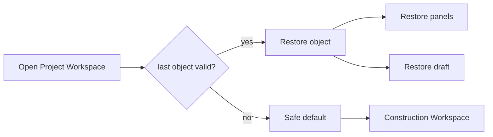
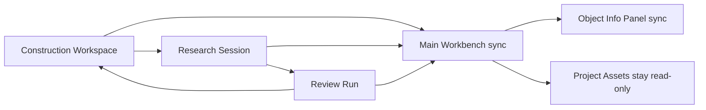
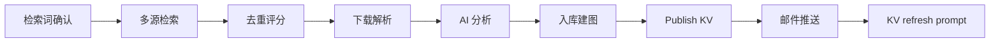
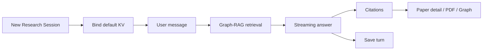

# UI / Workspace 设计

文档版本：v1.16
更新日期：2026-06-08
依据文档：`00_layers.md`、`01_functional_requirements.md`、当前工作树 `04_information_architecture_ui.md`

## 1. 设计目标

UI / Workspace 层负责用户可见的信息架构、入口、对象切换、状态展示和可操作 affordance。所有写操作最终必须通过 Application Use Cases 校验，前端禁用态只用于改善体验。

## 2. 全局页面结构

| 页面 | 主要内容 | 写操作入口 | 关联 FR |
| --- | --- | --- | --- |
| 登录/注册 | 账号登录、注册、公开错误页 | 注册、登录、登出 | FR-001 |
| Project Hub | Project 列表、创建入口、状态、最近活动、Knowledge Version 可用性 | 创建、编辑信息、归档、软删除、私人资产清理 | FR-008 |
| 用户设置 | 账户、LLM、数据源、通知 | 保存配置、测试连接、测试邮件 | FR-002 至 FR-004 |
| 管理员设置 | 用户管理、系统默认 LLM/数据源/SMTP、基础安全配置 | 用户治理、系统配置保存、连接测试 | FR-005 至 FR-007 |
| Project Workspace | Project 内 Construction/Research/Review 工作台与知识资产 | 通过具体对象工作台触发 | FR-011 至 FR-036 |

P1/P2 页面默认不进入 P0 主线框；少量已明确边界的 P1 支撑页可作为参考线框保留，其余仍在第 9.2 节作为后续能力清单保留，避免第一阶段实现范围膨胀。

## 3. Project Workspace Shell

Workspace Shell 必须绑定当前 Project，并分为以下稳定区域：

| 区域 | 职责 |
| --- | --- |
| 顶层栏 | Project 名称、状态、版本提示、系统级入口返回、用户菜单 |
| Project 选择栏 | 当前用户有权限的 Project 列表，可展开/折叠 |
| 对象选择栏 | Construction Workspace、Research Session 列表、Review Run 列表 |
| 主体流程栏 | 当前选中对象的主工作区，不可折叠 |
| Project 信息面板 | 论文库、Graph、Knowledge Version、构建状态和自动更新摘要 |
| Run/Session 信息面板 | 当前对象状态、配置快照、阶段、错误、引用、结果摘要 |

切换对象时，主体流程栏和 Run/Session 信息面板必须同步切换。面板展开/折叠、Project 跳转或系统级页面跳转不得中断后台任务或流式回复。

## 4. Workspace 对象入口

### 4.1 Construction Workspace

展示长期检索词、检索词级数据源策略、自动更新开关、构建状态摘要、历史 Construction Run 列表及其状态、配置快照入口、诊断入口、结果入口和手动启动入口。

写操作必须在 Construction Workspace 内触发，不在 Project 总列表中直接执行。

### 4.2 Research Session

展示对话历史、当前绑定 Knowledge Version、Graph-RAG 引用和跳转。同一 Session 存在流式回复时，输入区进入等待态，展示取消或查看状态入口。

### 4.3 Review Run

展示综述主题、范围、大纲、章节列表、章节状态、引用、审查记录、终稿、摘要、关键词、参考文献和可导出版本状态。章节写入中时，该章节的生成、覆盖操作应锁定；其他章节是否可编辑由应用用例校验。

## 5. 知识资产面板

Project 信息面板提供只读知识资产：

- 论文统计、列表、筛选和详情。
- PDF 或远程资源访问入口，必须使用鉴权或签名 URL。
- Graph 图谱节点、关系和论文详情互跳。
- Project 默认 Knowledge Version 与当前对象绑定版本。
- 缺失、过期、无权限、版本不匹配时的安全空态。

不得提供上传、删除、重新下载、重新解析、重新评分、重新分析、入库、推送或图谱重建动作。

## 6. 禁用态与提示

| 场景 | 展示行为 |
| --- | --- |
| 无可用 Knowledge Version | Research/Review 新建入口禁用，提示先完成一次 Construction Run |
| Project archived | Workspace 进入只读模式，写操作禁用并展示归档原因 |
| Project deleted | 禁止进入 Workspace，返回 Project Hub 并展示不可进入提示 |
| 权限不足 | 隐藏不可访问入口或展示无权限空态，后端仍必须拒绝 |
| 配置缺失/失效 | 任务启动按钮显示修复入口，指向用户设置或管理员设置 |
| active Construction Run 已存在 | 禁用同 Project 新 Construction Run，展示当前运行对象 |
| 内容覆盖风险 | 弹出覆盖确认，说明将覆盖的内容来源和最后编辑者 |
| Knowledge Version 过期 | 展示刷新提示，不自动改写当前内容 |

内容保护的权威判断由 Application Use Cases 和后台状态执行。UI 只展示用户完成当前决策所需的最小反馈，例如禁用原因、覆盖确认、冲突对象、影响范围和最后编辑者；不得依赖前端状态绕过后台保护，也不展示完整内部状态机。

## 7. 上下文恢复

P0 恢复最近打开 Project、最近打开对象、基础面板展开状态和输入草稿。P1 增强恢复滚动位置、日志和步骤落点、筛选条件、最近查看的论文或 Graph 节点。

恢复失败时应回到安全空态或 Project Hub，不得打开其他用户或其他 Project 的上下文。

## 8. UI 验收检查

- 每个 P0 FR 都能找到用户入口或明确的后台入口。
- P1/P2 FR 只在后续能力清单中保留，不展示完整主线框。
- UI 所有写操作对应一个 Application Use Case。
- archived/已删除不可进入/无权限/配置缺失/锁冲突/版本过期均有可见反馈。
- 知识资产面板只读。
- 引用跳转能处理缺失、过期和越权。
- 响应式范围至少覆盖桌面浏览器和平板/窄屏可用布局。


## 9. 页面线框附录（P0 主线框与 P1 参考）

适配说明：本附录已从旧 UI Wireframes v1.5 收敛为 P0 主线框；少量已明确边界的 P1 支撑页可作为参考线框保留。其余 P1/P2 页面不展示完整线框，只在 9.2 后续能力清单中保留。旧版遗留 UI 的处理原则如下：

| 处理方式 | UI 范围 | 原因 |
| --- | --- | --- |
| 保留并小修 | P01、P02、P03、P06、P07、P08、P09、P10a-P10f、P13、P14、P16、P17-P21、P23、P26-P28、P35-P42、P43-P46 | 能支撑 P0 主流程或明确的 P1 支撑页，但需隐藏其他 P1/P2 控件或收紧领域边界 |
| 删除并重设计 | P15、旧 P22、旧 P30-P32 | Construction Workspace、补充论文请求和知识资产面板都是新版领域设计，旧线框不足以承载 |
| 移入后续清单 | 旧 P04、旧 P05、旧 P12、旧 P24、旧 P25、旧 P29、旧 P33、旧 P34、旧 P37 的 Run/Session 部分 | 属于 P1/P2 或旧版统一实例操作，不进入 P0 主线框 |

P0 主线框中的知识资产入口保持只读，不提供上传、删除、重新解析、重新评分、入库、推送或图谱重建动作；阶段跳过不作为 Construction Run 的通用能力。

### P01 登录 / 注册

P01 为同一公开认证入口的两个界面状态：登录状态只收集登录凭证和密码；注册状态分别收集用户名、邮箱、密码和确认密码。用户名和邮箱是两个可不同的账号属性，登录凭证可使用用户名或邮箱。

#### P01a 登录

```text
┌──────────────────────────────────────────────────────────────┐
│ Research Paper Base                                          │
├──────────────────────────────────────────────────────────────┤
│                                                              │
│                 ┌──────────────────────────┐                 │
│                 │  [登录]       注册       │                 │
│                 ├──────────────────────────┤                 │
│                 │  用户名或邮箱             │                 │
│                 │  ┌────────────────────┐  │                 │
│                 │  │                    │  │                 │
│                 │  └────────────────────┘  │                 │
│                 │  密码              [👁]  │                 │
│                 │  ┌────────────────────┐  │                 │
│                 │  │                    │  │                 │
│                 │  └────────────────────┘  │                 │
│                 │  ┌────────────────────┐  │                 │
│                 │  │      登录           │  │                 │
│                 │  └────────────────────┘  │                 │
│                 │  错误 / 禁用状态         │                 │
│                 └──────────────────────────┘                 │
│                                                              │
└──────────────────────────────────────────────────────────────┘
```

#### P01b 注册

```text
┌──────────────────────────────────────────────────────────────┐
│ Research Paper Base                                          │
├──────────────────────────────────────────────────────────────┤
│                                                              │
│                 ┌──────────────────────────┐                 │
│                 │   登录       [注册]      │                 │
│                 ├──────────────────────────┤                 │
│                 │  用户名                  │                 │
│                 │  ┌────────────────────┐  │                 │
│                 │  │                    │  │                 │
│                 │  └────────────────────┘  │                 │
│                 │  邮箱                    │                 │
│                 │  ┌────────────────────┐  │                 │
│                 │  │                    │  │                 │
│                 │  └────────────────────┘  │                 │
│                 │  密码              [👁]  │                 │
│                 │  ┌────────────────────┐  │                 │
│                 │  │                    │  │                 │
│                 │  └────────────────────┘  │                 │
│                 │  确认密码          [👁]  │                 │
│                 │  ┌────────────────────┐  │                 │
│                 │  │                    │  │                 │
│                 │  └────────────────────┘  │                 │
│                 │  ┌────────────────────┐  │                 │
│                 │  │      注册           │  │                 │
│                 │  └────────────────────┘  │                 │
│                 │  错误 / 重复账号提示     │                 │
│                 └──────────────────────────┘                 │
│                                                              │
└──────────────────────────────────────────────────────────────┘
```

### P02 Project Workspace / Main Interface

#### P02a Project Hub

```text
┌────────────────────────────────────────────────────────────────────────────┐
│ Logo  Projects  Settings  Admin                     [Current Model ▼] Avatar│
├────────────────────────────────────────────────────────────────────────────┤
│ My Projects                                                               │
│ ┌────────────┬───────────────┬────────────┬────────────────┬──────────┐ │
│ │ 搜索        │ 状态 ▼         │ KV ▼        │ 构建状态 ▼       │ + Project│ │
│ └────────────┴───────────────┴────────────┴────────────────┴──────────┘ │
│                                                                            │
│ ┌────────────────────────────────────────────────────────────────────────┐ │
│ │ PRJ-0001  Project A                              active        KV-12  │ │
│ │ 面向 Graph-RAG 文献综述的点-线-面结构设计                                 │ │
│ │ 论文 128 | 资料 96 | 最近构建 2026-05-12 10:22 | 最近活动 2026-06-06 09:40│ │
│ │ 自动更新: on | 构建: CR-018 running | 进入后在 Construction Workspace 管理│ │
│ │ [进入] [编辑信息] [归档] [删除]                                       │ │
│ └────────────────────────────────────────────────────────────────────────┘ │
│ ┌────────────────────────────────────────────────────────────────────────┐ │
│ │ PRJ-0002  Project B                              active        无 KV  │ │
│ │ 项目内容B                         │ │
│ │ 论文 0 | 资料 0 | 最近构建 -- | 最近活动 2026-05-10 14:30              │ │
│ │ 自动更新: off | 构建: 未启动 | 进入后先打开 Construction Workspace       │ │
│ │ [进入] [编辑信息] [归档] [删除]                                       │ │
│ └────────────────────────────────────────────────────────────────────────┘ │
└────────────────────────────────────────────────────────────────────────────┘
```

Admin 入口仅对管理员显示；非管理员隐藏该入口，且后端仍必须拒绝非管理员访问管理员接口。

编辑信息仅修改 Project 名称、详细说明、研究主题/范围等基础元信息，不修改 Project 状态、Knowledge Version、论文资产、Run/Session 或自动更新设置。Project Hub 不提供 Project 级暂停/恢复；自动更新启停在 Construction Workspace 内管理。

#### P02b Project 新建 / 编辑

```text
┌──────────────────────────────────────────────────────────────┐
│ Project                                                [×]   │
├──────────────────────────────────────────────────────────────┤
│ 名称                                                         │
│ ┌──────────────────────────────────────────────────────────┐ │
│ └──────────────────────────────────────────────────────────┘ │
│ 研究主题 / 范围                                               │
│ ┌──────────────────────────────────────────────────────────┐ │
│ │                                                          │ │
│ │                                                          │ │
│ └──────────────────────────────────────────────────────────┘ │
│ 状态        [active ▼]                                       │
│ 构建设置    保存后在 Construction Workspace 管理自动更新       │
│                                                              │
│ [取消]                                           [保存]       │
└──────────────────────────────────────────────────────────────┘
```

### P06 个人设置

#### P06a 个人设置 / 账户

```text
┌────────────────────────────────────────────────────────────────────────────┐
│ Settings / Profile                                           Avatar       │
├──────────────────┬─────────────────────────────────────────────────────────┤
│ Profile          │ 账户信息                                                │
│ LLM              │ ┌─────────────────────────────────────────────────────┐ │
│ Sources          │ │ 用户名                                              │ │
│ Notifications    │ │ 邮箱                                                │ │
│                  │ │ 头像                                                │ │
│                  │ │ 账号状态                 enabled / disabled         │ │
│                  │ │ [保存]                                             │ │
│                  │ └─────────────────────────────────────────────────────┘ │
└──────────────────┴─────────────────────────────────────────────────────────┘
```

P06 只维护 FR-001 的用户基础信息；模型选择归 P07，收件邮箱和通知偏好归 P09。

#### P06b 个人设置 / LLM

```text
┌────────────────────────────────────────────────────────────────────────────┐
│ Settings / LLM                                               Avatar       │
├──────────────────┬──────────────────────┬─────────────────────────────────┤
│ Profile          │ LLM Configs          │ Config Editor / Lab OpenAI      │
│ LLM              │ + 添加配置            │ 配置名称                         │
│ Sources          │ ┌──────────────────┐ │                                 │
│ Notifications    │ │ > Lab OpenAI ok  │ │ 基础连接设置                     │
│                  │ │                  │ │ Type        [OpenAI ▼]          │
│                  │ │ Personal     err │ │ Base URL                        │
│                  │ │                  │ │ API Key               [👁]      │
│                  │ │ Local vLLM   off │ │ Enabled     [on/off]            │
│                  │ │                  │ │ [测试连接] [保存] [删除]        │
│                  │ └──────────────────┘ │                                 │
│                  │                      │ 可用模型查询                     │
│                  │                      │ [刷新模型列表]                   │
│                  │                      │ ┌───────────────┬─────────────┐ │
│                  │                      │ │ model         │ status      │ │
│                  │                      │ └───────────────┴─────────────┘ │
│                  │                      │                                 │
│                  │                      │ 详细参数配置 ▼                    │
│                  │                      │ Temperature                     │
│                  │                      │ Max_tokens                      │
│                  │                      │ Top P                           │
│                  │                      │ Timeout                         │
│                  │                      │ 其他参数 JSON                   │
│                  │                      │ 测试结果 / 失败原因              │
└──────────────────┴──────────────────────┴─────────────────────────────────┘
```

P07 使用列表-详情交互：右侧 Config Editor 始终编辑中间栏当前选中的 LLM 配置实例，并在标题中显示选中实例名称。中间栏展示 LLM 配置实例，而不是 provider 类型；同一 provider 类型可存在多个配置实例。P07 只管理配置实例、连接测试、可用模型查询和默认参数，不保存当前 Agent 调用模型。当前模型由主界面顶栏 `[Current Model ▼]` 从所有可用配置实例的模型列表中选择；用户未选择当前模型时，任务启动前必须提示选择，不得静默回落到系统默认模型。

#### P06c 个人设置 / 数据源

```text
┌────────────────────────────────────────────────────────────────────────────┐
│ Settings / Sources                                           Avatar       │
├──────────────────┬──────────────────────┬─────────────────────────────────┤
│ Profile          │ Sources              │ Source Editor / arXiv           │
│ LLM              │ + 添加               │ Type        [arXiv ▼]           │
│ Sources          │ ┌──────────────────┐ │ Enabled     [on/off]            │
│ Notifications    │ │ > arXiv     on   │ │ Base URL                        │
│                  │ │ OpenAlex    on   │ │ API Key               [👁]      │
│                  │ │ Semantic    off  │ │ Rate limit                      │
│                  │ │ ADS         err  │ │ [测试连接] [保存] [删除]        │
│                  │ └──────────────────┘ │                                 │
│                  │                      │ 最近状态 / 失败原因              │
│                  │                      │                                │
│                  │                      │                                │
│                  │                      │                                │
│                  │                      │                                │
└──────────────────┴──────────────────────┴─────────────────────────────────┘
```

P08 使用列表-详情交互：右侧 Source Editor 始终编辑中间栏当前选中的数据源配置，并在标题中显示选中数据源名称。

#### P06d 个人设置 / 通知（P1）

```text
┌────────────────────────────────────────────────────────────────────────────┐
│ Settings / Notifications                                     Avatar       │
├──────────────────┬──────────────────────┬─────────────────────────────────┤
│ Profile          │ 收件邮箱             │ Notification Editor / a@lab.edu │
│ LLM              │ + 添加               │ 邮箱                            │
│ Sources          │ ┌──────────────────┐ │ ┌─────────────────────────────┐ │
│ Notifications    │ │ > a@lab.edu on   │ │ └─────────────────────────────┘ │
│                  │ │ b@lab.edu   off  │ │ 接收论文/资料推送     [on/off]  │
│                  │ └──────────────────┘ │ 构建完成通知         [on/off]  │
│                  │                      │ 推送失败通知         [on/off]  │
│                  │                      │ 自动任务失败通知     [on/off]  │
│                  │                      │ 内容维度 [标题+摘要 ▼]          │
│                  │                      │ 汇总方式 [逐次 / 汇总 ▼]        │
│                  │                      │ [测试邮件] [保存] [删除]        │
│                  │                      │ 测试结果 / 失败原因              │
└──────────────────┴──────────────────────┴─────────────────────────────────┘
```

P09 使用列表-详情交互：右侧 Notification Editor 始终编辑中间栏当前选中的收件邮箱，并在标题中显示选中邮箱。P09 承载 FR-004 的用户收件邮箱、通知偏好和测试邮件。系统 SMTP / 发件邮箱仍由管理员系统配置维护。

### P10 管理员设置面板

#### P10a 管理员 / Users

```text
┌────────────────────────────────────────────────────────────────────────────┐
│ Admin / Users                                                Avatar       │
├──────────────┬─────────────────────────────────────────────────────────────┤
│ Users        │                                                            │
│ LLM          │ ┌──────────┬───────────────┬──────────┬──────────┬──────┐ │
│ Sources      │ │ 用户名    │ 邮箱           │ 角色      │ 状态      │ 操作  │ │
│ SMTP         │ ├──────────┼───────────────┼──────────┼──────────┼──────┤ │
│ Security     │ │ alice    │ a@lab.edu     │ admin    │ enabled  │ 操作▼ │ │
│ Backend      │ │ bob      │ b@lab.edu     │ user     │ disabled │ 操作▼ │ │
│              │ └──────────┴───────────────┴──────────┴──────────┴──────┘ │
└──────────────┴─────────────────────────────────────────────────────────────┘
```

P10a 的操作下拉包含查看、编辑邮箱、重置密码、设为管理员/撤销管理员、启用/禁用、删除。查看不需要二次确认；编辑邮箱、重置密码、设为管理员/撤销管理员、启用/禁用和删除都需要二次确认。最后一个启用管理员保护由后端强制执行，UI 只展示禁用原因。

#### P10b 管理员 / LLM

```text
┌────────────────────────────────────────────────────────────────────────────┐
│ Admin / LLM                                                  Avatar       │
├──────────────────┬──────────────────────┬─────────────────────────────────┤
│ Users            │ System LLM Configs   │ Config Editor / Default OpenAI  │
│ LLM              │ + 添加配置            │ 配置名称                         │
│ Sources          │ ┌──────────────────┐ │                                 │
│ SMTP             │ │ > Default   ok   │ │ 基础连接设置                     │
│ Security         │ │                  │ │ Type        [OpenAI ▼]          │
│ Backend          │ │ Backup     err   │ │ Base URL                        │
│                  │ │                  │ │ API Key               [👁]      │
│                  │ │ Local vLLM  off │ │ Enabled     [on/off]            │
│                  │ │                  │ │ [测试连接] [保存] [删除]        │
│                  │ └──────────────────┘ │                                 │
│                  │                      │ 可用模型查询                     │
│                  │                      │ [刷新模型列表]                   │
│                  │                      │ ┌───────────────┬─────────────┐ │
│                  │                      │ │ model         │ status      │ │
│                  │                      │ └───────────────┴─────────────┘ │
│                  │                      │                                 │
│                  │                      │ 详细参数配置 ▼                    │
│                  │                      │ Temperature                     │
│                  │                      │ Max_tokens                      │
│                  │                      │ Top P                           │
│                  │                      │ Timeout                         │
│                  │                      │ 其他参数 JSON                   │
│                  │                      │ 测试结果 / 失败原因              │
└──────────────────┴──────────────────────┴─────────────────────────────────┘
```

P10b 与 P07 使用一致的 LLM 配置实例编辑结构，但配置作用域为系统级默认 LLM 和平台硬限制；管理员不得查看或修改用户私人 LLM 配置和密钥。

#### P10c 管理员 / Sources

```text
┌────────────────────────────────────────────────────────────────────────────┐
│ Admin / Sources                                              Avatar       │
├──────────────────┬──────────────────────┬─────────────────────────────────┤
│ Users            │ System Sources       │ Source Editor / arXiv           │
│ LLM              │ + 添加               │ Type        [arXiv ▼]           │
│ Sources          │ ┌──────────────────┐ │ Enabled     [on/off]            │
│ SMTP             │ │ > arXiv     ok  │ │ Base URL                        │
│ Security         │ │ OpenAlex    ok  │ │ API Key               [👁]      │
│ Backend          │ │ ADS        err  │ │ Rate limit                      │
│                  │ └──────────────────┘ │ [测试连接] [保存] [删除]        │
│                  │                      │ 最近状态 / 失败原因              │
│                  │                      │                                │
│                  │                      │                                │
│                  │                      │                                │
│                  │                      │                                │
└──────────────────┴──────────────────────┴─────────────────────────────────┘
```

#### P10d 管理员 / SMTP

```text
┌────────────────────────────────────────────────────────────────────────────┐
│ Admin / SMTP                                                 Avatar       │
├──────────────────┬──────────────────────┬─────────────────────────────────┤
│ Users            │ SMTP Profiles        │ SMTP Editor / Primary SMTP      │
│ LLM              │ + 添加               │ 发件邮箱                         │
│ Sources          │ ┌──────────────────┐ │ Server / Host                   │
│ SMTP             │ │ > Primary   ok  │ │ Port                            │
│ Security         │ │ Backup    off   │ │ Encryption [选择 ▼]             │
│ Backend          │ └──────────────────┘ │ Auth Type  [选择 ▼]             │
│                  │                      │ 认证凭据                         │
│                  │                      │ Username（按认证方式显示）        │
│                  │                      │ Secret / API Key / Token [👁]    │
│                  │                      │ [测试发送] [保存] [删除]        │
│                  │                      │ 测试结果 / 失败原因              │
└──────────────────┴──────────────────────┴─────────────────────────────────┘
```

P10d 的 `Encryption` 明确连接加密方式，可选 None、SSL-TLS、STARTTLS。`Auth Type` 可选 None、Password、Token、API Key，并决定认证凭据区域的字段：None 不显示凭据；Password 显示 Username + Password；Token 显示 Username（按服务要求）+ Token；API Key 显示 API Key，Username 隐藏或可选。`API Key` 类型支持发件邮箱、server 和 API key 即可认证的邮件服务。

#### P10e 管理员 / Security

```text
┌────────────────────────────────────────────────────────────────────────────┐
│ Admin / Security                                             Avatar       │
├──────────────────┬─────────────────────────────────────────────────────────┤
│ Users            │ 可配置安全参数                                          │
│ LLM              │ ┌─────────────────────────────────────────────────────┐ │
│ Sources          │ │ 连接测试超时                                          │ │
│ SMTP             │ │ 连接测试重试次数                                      │ │
│ Security         │ │ 配置快照保留期                                        │ │
│ Backend          │ │ 诊断信息范围                                          │ │
│                  │ │ 模型白名单（P1）                                      │ │
│                  │ │ 允许数据源范围（P1）                                  │ │
│                  │ │ 系统级速率上限 / 并发上限（P1）                       │ │
│                  │ │ [保存]                                             │ │
│                  │ └─────────────────────────────────────────────────────┘ │
└──────────────────┴─────────────────────────────────────────────────────────┘
```

P10e 只展示管理员可以查看或更改的安全相关参数，不展示平台固定化安全规则。MVP 可配置项包括连接测试超时、连接测试重试次数、配置快照保留期和诊断信息范围；模型白名单、允许数据源范围、系统级速率上限和并发上限属于 P1。限制变更后，后续任务启动必须重新校验用户配置是否仍满足限制。

#### P10f 管理员 / Backend（P2）

```text
┌────────────────────────────────────────────────────────────────────────────┐
│ Admin / Backend                                              Avatar       │
├──────────────────┬──────────────────────┬─────────────────────────────────┤
│ Users            │ Backend Views        │ System Status                   │
│ LLM              │ ┌──────────────────┐ │ API             ok              │
│ Sources          │ │ > System Status  │ │ Queue           ok              │
│ SMTP             │ │ Scheduler        │ │ Scheduler       on              │
│ Security         │ │ Usage            │ │ Storage         ok              │
│ Backend          │ │ Diagnostics      │ │ Vector / Graph  ok              │
│                  │ └──────────────────┘ │                                 │
│                  │                      │ Scheduler                       │
│                  │                      │ Enabled     [on/off]            │
│                  │                      │ Period      [daily ▼]           │
│                  │                      │ Window      [02:00-06:00]       │
│                  │                      │ Last / Next run                 │
│                  │                      │                                 │
│                  │                      │ Usage Dashboard                 │
│                  │                      │ LLM requests / tokens           │
│                  │                      │ Source requests / failures      │
│                  │                      │                                 │
│                  │                      │ Diagnostics                     │
│                  │                      │ 脱敏系统诊断列表                 │
│                  │                      │ [刷新] [导出诊断摘要]           │
└──────────────────┴──────────────────────┴─────────────────────────────────┘
```

P10a-P10f 使用同一级管理员侧栏切换账号治理和系统配置项，避免把 Users 与 System 作为不对称的两级概念。系统级 LLM、Sources、SMTP 和 Security 只影响平台默认配置和硬限制，不允许管理员查看用户私人密钥明文。P10f 是 P2 后台信息展示入口，用于管理员查看系统状态、调度配置、系统级 LLM/数据源用量和脱敏系统诊断；不得展示用户私人配置、Project 权限、Project 内容、用户 prompt、上传文件或用户侧原始错误明细。

### P13 Project Workspace Shell

```text
┌────────────────────────────────────────────────────────────────────────────────────────────┐
│ Logo  Projects  Settings  Plaza  Admin*                 [Current Model ▼]  Avatar          │
├──────────────────────┬──────────────────────────────────────────┬──────────────────────────┤
│ Workspace Objects    │ Main Workbench                           │ Info Panels              │
│                      │                                          │                          │
│ Project A            │ ┌──────────────────────────────────────┐ │ [Project Assets ▾]      │
│ active               │ │ Construction Workspace               │ │ Papers / Materials      │
│                      │ │ current object / state / KV baseline │ │ Graph                   │
│ > Construction       │ │                                      │ │ Default KV: KV-12       │
│   Workspace          │ │ object-specific workflow content     │ │ Object KV: KV-12        │
│   Auto update: on    │ │                                      │ │ Build / auto summary    │
│   Terms: 6 active    │ │                                      │ │ [Open KV refresh]       │
│                      │ └──────────────────────────────────────┘ │                          │
│ Research Sessions    │                                          │ [Object Info ▾]          │
│ + New                │                                          │ Status / phase           │
│ ┌──────────────────┐ │                                          │ Waiting items            │
│ │ RS-023 active   │ │                                          │ Config snapshot          │
│ │ RS-020 done     │ │                                          │ Diagnostics              │
│ └──────────────────┘ │                                          │ Citations / results      │
│                      │                                          │                          │
│ Review Runs          │                                          │                          │
│ + New                │                                          │                          │
│ ┌──────────────────┐ │                                          │                          │
│ │ RV-008 running  │ │                                          │                          │
│ │ RV-004 done     │ │                                          │                          │
│ └──────────────────┘ │                                          │                          │
└──────────────────────┴──────────────────────────────────────────┴──────────────────────────┘
```

P13 Project Home 状态：

```text
┌────────────────────────────────────────────────────────────────────────────────────────────┐
│ Logo  Projects  Settings  Plaza  Admin*                 [Current Model ▼]  Avatar          │
├──────────────────────┬──────────────────────────────────────────┬──────────────────────────┤
│ Workspace Objects    │ Project Home                             │ Info Panels              │
│                      │                                          │                          │
│ > Project A          │ Project No.   PRJ-2026-001               │ [Project Assets ▾]      │
│ active               │ Description   long research topic...     │ Papers / Materials      │
│                      │ Papers 128 | Materials 24                │ Graph                   │
│ Construction         │ Last build      2026-06-08 02:10         │ Default KV: KV-12       │
│ Workspace            │ Last activity   2026-06-08 09:35         │ Build / auto summary    │
│ Research Sessions    │ Default KV      KV-12                    │                          │
│ Review Runs          │ Auto update     on, 6 terms              │ [Object Info ▾]          │
│                      │ [Open Construction] [New Research]       │ No object selected       │
│                      │ [New Review]                             │                          │
└──────────────────────┴──────────────────────────────────────────┴──────────────────────────┘
```

P13 是进入某个 Project 后的唯一 Workspace Shell，不再展示其他 Project 列表；切换 Project 应通过顶栏 `Projects` 返回 Project Hub 或打开 Project 选择器完成。左侧栏首行显示当前 Project 名称和最小状态，点击 Project 名称或首次打开 Workspace 时，Main Workbench 显示 Project Home 概览；用户选择 Construction Workspace、Research Session 或 Review Run 后，Project Home 概览退出，不持续占用工作界面。

Project Home 只用于快速查看 Project 编号、详细说明、论文数、资料数、最近构建时间、最近活动时间、默认 Knowledge Version 和自动更新摘要，并提供进入构建、深研或综述入口。左侧除 Project 名称外，只展示当前 Project 的唯一 Construction Workspace、Research Session 列表和 Review Run 列表；历史 Construction Run 不与 Session/Run 平级展示，只能在 Construction Workspace 内部查看。选择对象时，Main Workbench 和 Object Info 面板必须同步切换；Project Assets 面板保持只读，承载论文、Project 资料、Graph、默认 Knowledge Version、当前对象绑定 Knowledge Version、构建摘要和版本刷新入口。

当 Project 为 archived 时，P13 保持可进入但进入只读模式，禁用新建、启动、继续生成、上传、删除、重跑和刷新依赖等写操作，并展示只读原因。无可用 Knowledge Version 时，Research Session 和 Review Run 的新建入口禁用，并提示先完成一次 Construction Run。Admin 入口仅对管理员显示；Project Workspace 内的系统级入口条件与 Project Hub 保持一致。

### P14 Workspace 空态 / 禁用态

```text
┌────────────────────────────────────────────────────────────────────────────┐
│ Project A                                               active / archived │
├────────────────────────────────────────────────────────────────────────────┤
│                                                                            │
│                         ┌──────────────────────┐                           │
│                         │ Construction        │                           │
│                         │ [打开构建工作台]     │                           │
│                         └──────────────────────┘                           │
│                                                                            │
│                         ┌──────────────────────┐                           │
│                         │ Research Session     │                           │
│                         │ [需要可用 KV]        │                           │
│                         └──────────────────────┘                           │
│                                                                            │
│                         ┌──────────────────────┐                           │
│                         │ Review Run           │                           │
│                         │ [需要可用 KV]        │                           │
│                         └──────────────────────┘                           │
│                                                                            │
└────────────────────────────────────────────────────────────────────────────┘
```

### P15 Construction Workspace

```text
┌────────────────────────────────────────────────────────────────────────────┐
│ Construction Workspace      Project A | default KV: KV-12 | active CR-018 │
├────────────────────────────────────────────────────────────────────────────┤
│ 构建状态摘要                                                               │
│ 论文 128 | 检索词 12 | 自动更新词 6 | 最近成功 CR-017 | 新版本写入中       │
│ [启动手动 Run]  [生成检索词]  [手动添加检索词]  配置缺失时显示修复入口     │
├──────────────────────────────┬─────────────────────────────────────────────┤
│ 检索词集合                    │ 自动更新与历史运行                           │
│ ┌──────────────────────────┐ │ 自动更新摘要                                 │
│ │ term-01                  │ │ ┌─────────────────────────────────────────┐ │
│ │ 关键词 / 布尔式 / 排除词  │ │ │ enabled terms: 6 | next window: 02:00  │ │
│ │ 理由 / 覆盖方向           │ │ │ datasource: arXiv ok | OA ok | ADS err │ │
│ │ 自动更新 [on]             │ │ └─────────────────────────────────────────┘ │
│ │ 数据源策略 [arXiv OA]     │ │                                             │
│ │ 状态: 人工确认            │ │ 历史 Construction Runs                     │
│ │ [编辑草稿] [确认修改]     │ │ ┌───────┬────────┬─────────┬────────────┐ │
│ └──────────────────────────┘ │ │ Run   │ 类型    │ 状态     │ 操作        │ │
│ ┌──────────────────────────┐ │ │ CR-018│ auto   │ running │ 查看状态    │ │
│ │ term-02                  │ │ │ CR-017│ manual │ success │ 查看结果    │ │
│ │ 自动更新 [off]            │ │ │ CR-016│ auto   │ failed  │ 查看诊断    │ │
│ └──────────────────────────┘ │ └───────┴────────┴─────────┴────────────┘ │
├──────────────────────────────┴─────────────────────────────────────────────┤
│ 补充论文请求队列                                                           │
│ [新增请求] DOI / arXiv ID / URL / PDF 文件                                 │
│ ┌────────┬──────────┬────────────┬────────────┬─────────────────────────┐ │
│ │ 来源   │ 提交值    │ 解析状态     │ 确认状态     │ 下一步                  │ │
│ │ DOI    │ 10.x/abc │ 待确认       │ 用户确认中   │ 查看候选元数据          │ │
│ │ PDF    │ file.pdf │ 元数据不足   │ 待补充       │ 补充标题 / 作者 / 年份  │ │
│ │ URL    │ site/... │ 已转候选     │ 已确认       │ 在下次 Run 中进入筛选   │ │
│ └────────┴──────────┴────────────┴────────────┴─────────────────────────┘ │
└────────────────────────────────────────────────────────────────────────────┘
```

Construction Workspace 是每个 Project 唯一的长期构建配置容器，不是一次运行，也不直接生成 Knowledge Version。补充论文请求先形成待确认记录，不直接写入 ProjectPaper，也不直接挂到某个当前 Run。

### P43 检索词生成审核

```text
┌────────────────────────────────────────────────────────────────────────────┐
│ 检索词生成审核                                      [接受选中] [弃用选中]│
├────────────────────────────────────────────────────────────────────────────┤
│ 生成来源: Project 主题 / 最近论文 / 用户补充范围                          │
│ ┌────┬──────────────┬──────────────┬────────────┬────────────┬──────────┐ │
│ │ 选 │ 关键词        │ 布尔 / 排除词 │ 数据源策略  │ 理由        │ 状态      │ │
│ ├────┼──────────────┼──────────────┼────────────┼────────────┼──────────┤ │
│ │ ☑  │ term-01      │ A AND B -C   │ arXiv OA   │ 覆盖方向 1  │ 候选      │ │
│ │ ☐  │ term-02      │ D OR E -F    │ ADS        │ 覆盖方向 2  │ 已编辑    │ │
│ └────┴──────────────┴──────────────┴────────────┴────────────┴──────────┘ │
│ 当前项: [编辑关键词] [编辑数据源] 自动更新 [on/off] [接受] [弃用]           │
└────────────────────────────────────────────────────────────────────────────┘
```

生成审核只在 Construction Workspace 内出现。候选词被接受后进入长期检索词列表；被弃用的候选保留最小记录用于避免重复建议。批量接受、弃用和人工编辑均必须通过应用用例校验。

### P16 手动 Construction Run 启动

```text
┌──────────────────────────────────────────────────────────────┐
│ 启动 Construction Run                                  [×]   │
├──────────────────────────────────────────────────────────────┤
│ 检索词                                                       │
│ ☑ term-01   ☑ term-02   ☐ term-03   ☑ term-04               │
│                                                              │
│ 时间范围        ┌──────────────┐ 至 ┌──────────────┐         │
│ 返回上限        ┌──────────────┐                              │
│                                                              │
│ 配置快照                                                       │
│ ┌──────────────────────────────────────────────────────────┐ │
│ │ LLM source / model | sources | rate limits | SMTP        │ │
│ └──────────────────────────────────────────────────────────┘ │
│                                                              │
│ [取消]                                           [启动]       │
└──────────────────────────────────────────────────────────────┘
```

### P17 Construction Run

```text
┌────────────────────────────────────────────────────────────────────────────┐
│ CR-018  auto  running  KV output: pending          [取消] [查看日志]      │
├────────────────────────────────────────────────────────────────────────────┤
│ ① 检索词  ② 多源检索  ③ 去重评分  ④ 下载解析  ⑤ AI 分析  ⑥ 入库建图  ⑦ 邮件 │
├──────────────────────┬─────────────────────────────────────────────────────┤
│ Step                 │ 当前步骤                                            │
│ ① done              │ ┌─────────────────────────────────────────────────┐ │
│ ② done              │ │ 去重评分                                         │ │
│ ③ waiting           │ │ 输入: candidates 183 | existing 42              │ │
│ ④ locked            │ │ 输出: valid 61 | invalid 80 | duplicate 42      │ │
│ ⑤ locked            │ │ 等待: 用户确认有效论文                           │ │
│ ⑥ locked            │ │ 错误: ADS timeout                                │ │
│ ⑦ locked            │ └─────────────────────────────────────────────────┘ │
│                      │                                                     │
│                      │ ┌──────────────┬────────┬──────┬────────┬────────┐ │
│                      │ │ 标题          │ 来源   │ 分数 │ 状态    │ 操作    │ │
│                      │ ├──────────────┼────────┼──────┼────────┼────────┤ │
│                      │ │ paper A      │ arXiv  │ 9.1  │ valid  │ 详情 调整│ │
│                      │ │ paper B      │ OA     │ 5.4  │ invalid│ 详情 调整│ │
│                      │ └──────────────┴────────┴──────┴────────┴────────┘ │
│                      │                                                     │
│                      │ [调整有效性] [确认并继续]                            │
└──────────────────────┴─────────────────────────────────────────────────────┘
```

### P44 Construction Run / 多源检索结果

```text
┌────────────────────────────────────────────────────────────────────────────┐
│ CR-018  多源检索                                      [取消] [查看日志]   │
├────────────────────────────────────────────────────────────────────────────┤
│ 检索词 4 | 数据源 3 | 返回 183 | 失败 1 | 限流 1                         │
│ ┌──────────┬────────┬────────────────────┬──────┬────────┬────────────┐ │
│ │ 检索词    │ 数据源 │ 查询式              │ 返回 │ 状态    │ 诊断 / 操作 │ │
│ ├──────────┼────────┼────────────────────┼──────┼────────┼────────────┤ │
│ │ term-01  │ arXiv  │ A AND B -C          │ 92   │ done   │ 查看       │ │
│ │ term-01  │ ADS    │ A AND B -C          │ 0    │ limited│ 查看诊断   │ │
│ │ term-02  │ OA     │ D OR E -F           │ --   │ failed │ 查看诊断   │ │
│ └──────────┴────────┴────────────────────┴──────┴────────┴────────────┘ │
│ [确认可用结果并继续]                                                       │
└────────────────────────────────────────────────────────────────────────────┘
```

本视图只展示检索执行结果和诊断入口，不提供跳过阶段、手动改写返回结果或绕过数据源策略的操作。

### P18 Construction Run / 下载解析

```text
┌────────────────────────────────────────────────────────────────────────────┐
│ CR-018  下载解析                                                    [取消]│
├────────────────────────────────────────────────────────────────────────────┤
│ 成功 48    失败 7    摘要降级 6    待处理 3                              │
├────────────────────────────────────────────────────────────────────────────┤
│ ┌──────────────┬────────────┬────────────┬────────────┬────────────────┐ │
│ │ 标题          │ PDF        │ 解析        │ 降级文本     │ 操作            │ │
│ ├──────────────┼────────────┼────────────┼────────────┼────────────────┤ │
│ │ paper A      │ ok         │ ok         │ no         │ 打开            │ │
│ │ paper B      │ failed     │ --         │ abstract   │ 查看诊断        │ │
│ └──────────────┴────────────┴────────────┴────────────┴────────────────┘ │
│                                                                            │
│ [确认并继续]                                                               │
└────────────────────────────────────────────────────────────────────────────┘
```

### P19 Construction Run / AI 分析

```text
┌────────────────────────────────────────────────────────────────────────────┐
│ CR-018  AI 分析                                                      [取消]│
├──────────────────────┬─────────────────────────────────────────────────────┤
│ 论文列表              │ 分析编辑                                            │
│ paper A              │ 一句话总结                                          │
│ paper B              │ ┌─────────────────────────────────────────────────┐ │
│ paper C              │ └─────────────────────────────────────────────────┘ │
│                      │ 亮点                                                │
│                      │ ┌─────────────────────────────────────────────────┐ │
│                      │ └─────────────────────────────────────────────────┘ │
│                      │ 相关性要点                                          │
│                      │ ┌─────────────────────────────────────────────────┐ │
│                      │ └─────────────────────────────────────────────────┘ │
│                      │ 方法与创新                                          │
│                      │ ┌─────────────────────────────────────────────────┐ │
│                      │ └─────────────────────────────────────────────────┘ │
│                      │ [重新生成] [保存人工修改] [确认]                   │
└──────────────────────┴─────────────────────────────────────────────────────┘
```

### P20 Construction Run / 入库建图

```text
┌────────────────────────────────────────────────────────────────────────────┐
│ CR-018  入库建图                                                    [取消]│
├────────────────────────────────────────────────────────────────────────────┤
│ 即将入库 valid 61 | 跳过 existing 42 | 风险 3                             │
│ ┌──────────────────────────────────────────────────────────────────────┐   │
│ │ 论文入库     pending / running / done / failed                        │   │
│ │ 向量切分     pending / running / done / failed                        │   │
│ │ Graph 更新   pending / running / done / failed                        │   │
│ │ KV 发布      pending / running / done / failed                        │   │
│ └──────────────────────────────────────────────────────────────────────┘   │
│                                                                            │
│ [开始入库] [查看失败项] [打开论文库] [打开 Graph]                          │
└────────────────────────────────────────────────────────────────────────────┘
```

### P21 Construction Run / 邮件推送

```text
┌────────────────────────────────────────────────────────────────────────────┐
│ CR-018  邮件推送                                                        │
├────────────────────────────────────────────────────────────────────────────┤
│ 新增有效论文 24 | 未推送 24 | 收件人 2 | 空邮件保护: 强制启用            │
│ ┌──────────────────────────────────────────────────────────────────────┐   │
│ │ Project 名称                                                         │   │
│ │ 有效论文统计                                                         │   │
│ │ 论文摘要列表 / 来源检索词 / 来源数据源                                │   │
│ └──────────────────────────────────────────────────────────────────────┘   │
│                                                                            │
│ [预览] [发送]  无可推送论文时跳过发送并记录原因                         │
└────────────────────────────────────────────────────────────────────────────┘
```

无未推送有效论文时不得发送空邮件；系统只记录跳过原因和可诊断状态。

### P23 Research Session

```text
┌────────────────────────────────────────────────────────────────────────────┐
│ RS-023  active  Bound KV: KV-12                         [刷新版本] [状态]│
├──────────────────────┬──────────────────────────────────────┬──────────────┤
│ Sessions             │ Conversation                         │ Evidence     │
│ + New                │ ┌──────────────────────────────────┐ │ KV-12        │
│ RS-023 active        │ │ User                              │ │ Citations    │
│ RS-020 archived      │ │ 研究问题...                       │ │ [paper A]    │
│                      │ ├──────────────────────────────────┤ │ [paper B]    │
│ Search / Tags        │ │ Agent                             │ │ Passages     │
│                      │ │ 回复流式输出... [paper A] [node] │ │ Graph hits   │
│                      │ ├──────────────────────────────────┤ │ [打开论文]   │
│                      │ │ Agent generating █                │ │ [打开 Graph] │
│                      │ └──────────────────────────────────┘ │              │
│                      │ ┌────────────────────────────┬─────┐ │              │
│                      │ │ 输入草稿                    │ 发送│ │              │
│                      │ └────────────────────────────┴─────┘ │              │
└──────────────────────┴──────────────────────────────────────┴──────────────┘
```

### P45 Research Session / 流式等待与失败恢复

```text
┌────────────────────────────────────────────────────────────────────────────┐
│ RS-023  generating  Bound KV: KV-12                  [取消生成] [状态]    │
├──────────────────────┬──────────────────────────────────────┬──────────────┤
│ Sessions             │ Conversation                         │ Evidence     │
│ RS-023 active        │ Agent 正在生成...                    │ 引用加载中   │
│                      │ ┌──────────────────────────────────┐ │ paper A ok   │
│                      │ │ 回复流式输出...                  │ │ paper B 等待 │
│                      │ └──────────────────────────────────┘ │ Graph hits   │
│                      │ ┌────────────────────────────┬─────┐ │              │
│                      │ │ 输入草稿已保留              │ 禁用│ │              │
│                      │ └────────────────────────────┴─────┘ │              │
│                      │ 失败时: 错误摘要 / [保留草稿]          │ 引用失败提示 │
└──────────────────────┴──────────────────────────────────────┴──────────────┘
```

流式回复期间不得重复发送同一 Session 的新消息。取消和草稿恢复必须通过 Research Session 的应用用例执行；UI 只展示当前等待、失败和引用加载状态。

### P46 Review Run 新建向导

```text
┌──────────────────────────────────────────────────────────────┐
│ 新建 Review Run                                        [×]   │
├──────────────────────────────────────────────────────────────┤
│ 主题                                                         │
│ ┌──────────────────────────────────────────────────────────┐ │
│ └──────────────────────────────────────────────────────────┘ │
│ 范围 / 排除方向                                               │
│ ┌──────────────────────────────────────────────────────────┐ │
│ └──────────────────────────────────────────────────────────┘ │
│ 目标读者        [领域研究者 ▼]                               │
│ 篇幅 / 深度      [中等综述 ▼]                                 │
│ 时间范围        ┌──────────────┐ 至 ┌──────────────┐         │
│ 引用偏好        ☑ 高相关  ☑ 近年  ☐ 经典基础                  │
│ Bound KV        KV-12                                         │
│                                                              │
│ [取消]                                      [生成大纲]        │
└──────────────────────────────────────────────────────────────┘
```

新建向导只收集生成大纲所需的最小边界。提交后创建 Review Run、绑定当前可用 Knowledge Version，并进入 P26 大纲生成与确认。

### P26 Review Run / 大纲

```text
┌────────────────────────────────────────────────────────────────────────────┐
│ RV-008  outline  Bound KV: KV-12                  [生成大纲] [确认大纲]  │
├──────────────────────┬──────────────────────────────────────┬──────────────┤
│ Review Runs          │ Outline Editor                       │ Context      │
│ + New                │ 标题                                  │ KV-12        │
│ RV-008 running       │ ┌──────────────────────────────────┐ │ 章节支撑度   │
│ RV-004 done          │ └──────────────────────────────────┘ │ 1 █████      │
│                      │ 摘要提示                              │ 2 ███        │
│ Steps                │ ┌──────────────────────────────────┐ │ 3 ██ low     │
│ ① 大纲 waiting       │ └──────────────────────────────────┘ │ 建议补充方向 │
│ ② 章节 locked        │                                      │ Papers       │
│ ③ 汇总 locked        │ 章节                                  │ Graph        │
│ ④ 可导出版本 locked  │ ┌────┬──────────┬──────┬──────────┐ │              │
│                      │ │ No │ 标题      │ 类型  │ 操作      │ │              │
│                      │ │ 1  │ 引言      │ 背景  │ ↑ ↓ 编辑  │ │              │
│                      │ │ 2  │ 方法      │ 主题  │ ↑ ↓ 编辑  │ │              │
│                      │ └────┴──────────┴──────┴──────────┘ │              │
└──────────────────────┴──────────────────────────────────────┴──────────────┘
```

### P27 Review Run / 章节

```text
┌────────────────────────────────────────────────────────────────────────────┐
│ RV-008  chapter 2  Bound KV: KV-12           [生成] [审查] [确认章节]     │
├──────────────────────┬──────────────────────────────────────┬──────────────┤
│ Chapters             │ Markdown Editor                      │ Citations    │
│ 1 引言 已确认        │ ┌──────────────────────────────────┐ │ paper A      │
│ 2 方法 编辑中        │ │ ## 章节正文                       │ │ passage 1    │
│ 3 实验 待生成        │ │ ... [paper A]                     │ │ paper B      │
│ 4 未来 写入中        │ │                                  │ │ Graph nodes  │
│                      │ └──────────────────────────────────┘ │ Coverage     │
│ 审查记录              │                                      │ ███████░░    │
│ issue 1 open         │ 审查问题                              │ [论文详情]   │
│ issue 2 accepted     │ ┌──────────────────────────────────┐ │ [PDF]        │
│                      │ │ 准确性 / 完整性 / 逻辑 / 引用规范 │ │ [Graph]      │
│                      │ └──────────────────────────────────┘ │              │
│                      │ [接受建议] [手动编辑] [确认修改]      │              │
└──────────────────────┴──────────────────────────────────────┴──────────────┘
```

### P28 Review Run / 终稿

```text
┌────────────────────────────────────────────────────────────────────────────┐
│ RV-008  final  Bound KV: KV-12     [生成摘要] [终审] [确认终稿]           │
├──────────────────────┬──────────────────────────────────────┬──────────────┤
│ Document             │ Full Draft                           │ Final Check  │
│ 摘要                 │ ┌──────────────────────────────────┐ │ KV-12        │
│ 关键词               │ │ 标题                              │ │ 引用覆盖     │
│ 章节                 │ │ 摘要                              │ │ ████████░   │
│ 参考文献             │ │ 正文                              │ │ 参考文献 ok  │
│                      │ │ 参考文献                          │ │ 终审问题 3   │
│ 可导出版本状态       │ └──────────────────────────────────┘ │ exportable   │
│ pending              │                                      │ pending      │
│                      │ [编辑] [确认可导出版本]              │              │
└──────────────────────┴──────────────────────────────────────┴──────────────┘
```

### P30 ProjectKnowledgeAssetPanel

```text
┌────────────────────────────────────────────────────────────────────────────┐
│ Project Knowledge Assets              Project KV: KV-13 | Object KV: KV-12│
├────────────────────────────────────────────────────────────────────────────┤
│ [Papers] [Graph] [Version]   引用跳转: RS-023 / paper A / passage 3       │
├──────────────────────────────┬─────────────────────────────────────────────┤
│ 论文库只读列表                │ 论文详情 / Graph 焦点                       │
│ 搜索 标题/摘要/作者           │ ┌─────────────────────────────────────────┐ │
│ 来源 ▼ 评分 ▼ 有效性 ▼ 引用 ▼ │ │ 标题 / 作者 / 年份 / DOI / arXiv ID     │ │
│ ┌──────────────┬────┬──────┐ │ │ 评分 / 有效性 / 引用状态 / 文本来源     │ │
│ │ 标题          │ 分 │ 操作 │ │ │ 摘要 / 一句话总结 / 亮点 / 方法与创新  │ │
│ │ paper A      │9.1 │ 查看 │ │ │ [打开 PDF] [远程访问] [打开 Graph 节点]│ │
│ │ paper B      │7.2 │ 查看 │ │ └─────────────────────────────────────────┘ │
│ └──────────────┴────┴──────┘ │ ┌─────────────────────────────────────────┐ │
│                              │ │ Graph 只读视图: Paper / Author / Method │ │
│                              │ │ ○──○──○  节点详情 / 关系边 / 引用来源   │ │
│                              │ └─────────────────────────────────────────┘ │
├──────────────────────────────┴─────────────────────────────────────────────┤
│ 安全空态: PDF 缺失 / Graph 节点缺失 / 越权 / 版本不匹配 / 引用过期时展示原因 │
└────────────────────────────────────────────────────────────────────────────┘
```

知识资产面板只读取当前 Project、当前用户权限和指定 Knowledge Version 范围内的论文、文件访问引用、Graph 投影和引用证据。论文详情与 Graph 互跳只改变查看焦点，不触发任何写操作。

### P35 知识库版本刷新

```text
┌──────────────────────────────────────────────────────────────┐
│ Knowledge Version                                      [×]   │
├──────────────────────────────────────────────────────────────┤
│ Project 默认版本       KV-13                                │
│ 当前对象绑定版本       KV-12                                │
│ 打开来源               Project Versions / Bound KV / 系统提示 │
│                                                              │
│ 依赖旧版本对象                                               │
│ ┌──────────────┬────────────┬────────────┬────────────────┐ │
│ │ 对象          │ 类型        │ 状态        │ 刷新可用        │ │
│ ├──────────────┼────────────┼────────────┼────────────────┤ │
│ │ RS-023       │ Research   │ active     │ no             │ │
│ │ RV-008       │ Review     │ inactive   │ yes            │ │
│ └──────────────┴────────────┴────────────┴────────────────┘ │
│                                                              │
│ 已完成内容保持不变                                           │
│ Review 后续章节使用新版本                                    │
│                                                              │
│ [稍后]                [保持旧版本]        [刷新可用对象]       │
└──────────────────────────────────────────────────────────────┘
```

### P36 冲突 / 覆盖 / 锁定

```text
┌──────────────────────────────────────────────────────────────┐
│ 当前操作不可执行                                      [×]    │
├──────────────────────────────────────────────────────────────┤
│ ○ 已有 active Construction Run                               │
│ ○ 当前回复正在生成                                           │
│ ○ 当前章节正在写入                                           │
│ ○ 人工修改内容需要覆盖确认                                   │
│ ○ 当前无可用 Knowledge Version                               │
│ ○ archived Project 只读                                      │
│                                                              │
│ 影响对象                                                     │
│ ┌──────────────────────────────────────────────────────────┐ │
│ └──────────────────────────────────────────────────────────┘ │
│                                                              │
│ [关闭] [查看对象] [确认覆盖] [稍后处理]                       │
└──────────────────────────────────────────────────────────────┘
```

### P37 Project 高风险确认

```text
┌──────────────────────────────────────────────────────────────┐
│ 确认操作                                               [×]   │
├──────────────────────────────────────────────────────────────┤
│ 操作: Project 归档 / Project 软删除 / Project 私人资产清理    │
│ 对象: 当前 Project                                           │
│                                                              │
│ 影响范围                                                     │
│ ┌──────────────────────────────────────────────────────────┐ │
│ │ 私人运行记录 / Project-Paper 关联 / PDF / Graph / 导出保留 │ │
│ └──────────────────────────────────────────────────────────┘ │
│                                                              │
│ 输入名称确认                                                 │
│ ┌──────────────────────────────────────────────────────────┐ │
│ └──────────────────────────────────────────────────────────┘ │
│                                                              │
│ [取消]                                      [确认执行]       │
└──────────────────────────────────────────────────────────────┘
```

Run/Session 归档、删除和跨类型统一实例操作属于后续增强，不进入 P0 主线框。

### P38 上下文恢复



### P39 Workspace 对象切换



### P40 Construction Run 流程



### P41 Research Session 流程



### P42 Review Run 流程


### 9.2 后续能力清单

以下 UI 不在 P0 主线框展示，后续实现时再补独立线框：

| 后续范围 | 对应 FR | 处理说明 |
| --- | --- | --- |
| 观点广场与发布页 | FR-010, P2 | 保留需求，不在 P0 顶层导航和主线框展示 |
| 系统状态与诊断页 | FR-006, P2 | 管理员系统诊断不进入 MVP 主线框 |
| Research 输出倾向、总结文件和导出 | FR-029, FR-030, P1 | 不在 P0 Research Session 顶栏展示 |
| Project/Run/Session 导出中心 | FR-019, P1 | 后续补异步任务状态、下载和失败报告 |
| Review 版本历史、差异和回退 | FR-036, P2 | 不在 P0 Review Run 入口展示 |
| Run/Session 复制、重跑、归档和删除 | FR-014, FR-015, P1 | 不使用旧版统一实例操作弹窗；后续按对象分别设计 |
| 批量补充论文 | FR-023, P1 | P0 仅保留 Construction Workspace 内的单条补充请求队列 |

## 10. 设计审查结果（2026-06-01）

本次审查目标：逐条分辨旧版 UI Wireframes v1.5 迁入内容是否仍符合 `01_functional_requirements.md` 和 `02_domain_core.md` 的新版边界，并将主线框收敛到 P0。

总体结论：旧版页面体系可以保留为导航参考，但主线框必须隐藏大多数 P1/P2 内容；边界明确的 P1 支撑页可作为参考线框保留。Construction Workspace、知识资产面板和论文补充入口属于新版领域设计，旧版线框已删除并重画；邮件推送页面已改为空邮件保护强制启用。

| 优先级 | 涉及 FR | 审查发现 | 本版处理 |
| --- | --- | --- | --- |
| P0 | FR-011 至 FR-018 | Workspace Shell、对象切换、版本刷新和冲突提示方向正确，但旧版混入后续入口。 | 保留 Shell 和状态页；主线框只展示 Construction Workspace、Research Session、Review Run 三类顶层对象。 |
| P0 | FR-020 至 FR-026 | 旧 P15 无法体现 Construction Workspace 作为长期配置容器，也混入后续增强动作。 | 重画 P15，加入构建摘要、检索词集合、自动更新摘要、历史 Run 查看和补充论文请求队列。 |
| P0 | FR-012, FR-018, FR-031, FR-033 | 旧 P30-P32 是页面级资产浏览，未明确 Project/Object KV、引用跳转和安全空态。 | 重画 P30 为只读 ProjectKnowledgeAssetPanel。 |
| P0/P1 | FR-023 | 旧 P22 把论文补充直接加入当前 Run，不符合 ManualPaperSupplementRequest 边界。 | 删除旧 P22；补充论文请求归属 P15 队列。 |
| P1 | FR-027 | 旧 P21 存在可关闭空邮件保护的错误文案。 | 改为强制启用，空范围只记录跳过原因。 |
| P1/P2 | FR-010, FR-019, FR-029, FR-030, FR-036 | 旧版后续能力线框过早出现在主线框中。 | 移入 9.2 后续能力清单，不展示完整线框；FR-004 已补 P09 参考线框。 |

### 10.1 交互习惯评估

- 研究人员的高频路径是“进入 Project -> 查看知识资产状态 -> 发起构建/研究/综述 -> 回看引用和 PDF”。当前 Shell 和知识资产面板能支撑该路径。
- 构建流程涉及多步等待和人工确认，用户需要更强的过程可解释性。当前线框已有步骤容器，但还需要把每一步失败原因、等待项和人工决策结果展示得更稳定。
- Research 对话应避免用户在流式回复中重复发送或丢失草稿。等待态、取消态和失败恢复需要成为明确 UI 状态。
- Review 写作属于长流程编辑，内容保护由后台裁决；UI 只需在覆盖、锁冲突或失败时给出最小必要提示，避免暴露完整内部状态机。
- 后续导出和 PDF 集合可能耗时较长，应符合异步任务交互习惯：启动后可离开、可查看进度、完成后可下载、失败后可诊断。

### 10.2 后续 UI 补强清单

后续补强不要求一次性重写本文档，按 9.2 清单分阶段补充即可。

## 11. 更改记录

| 版本 | 日期 | 变更摘要 |
| --- | --- | --- |
| v1.16 | 2026-06-08 | 调整 P13 Project Workspace：移除常驻 Project 详情条，将左侧栏首行改为当前 Project 名称；Project 详细信息仅在首次打开 Workspace 或点击 Project 名称时以 Project Home 展示。 |
| v1.15 | 2026-06-08 | 根据 FR-011/FR-012/FR-013/FR-018 重新设计 P13：移除 Workspace 内 Project Rail，改为当前 Project 绑定的对象切换、主体工作区、只读 Project Assets 和同步 Object Info 面板。 |
| v1.14 | 2026-06-08 | 收紧 P10e Security：删除密钥脱敏、密钥隔离、快照禁止明文密钥等固定化安全规则的 UI 展示，只保留管理员可查看或更改的安全参数和 P1 硬限制。 |
| v1.13 | 2026-06-08 | 根据 FR-006/FR-007 调整 P10e Security 为基础安全限制与 P1 硬限制配置，并新增 P10f Backend（P2）展示系统状态、调度、用量和脱敏诊断后台。 |
| v1.12 | 2026-06-08 | 调整 P10d SMTP 配置：将 TLS/SSL 改为 Encryption 选择，并新增 Auth Type 以支持 None、Password、Token 和 API Key 认证方式；将动态凭据字段改为认证凭据分组。 |
| v1.11 | 2026-06-08 | 重构管理员设置线框：去掉 Users/System 二分，改为 P10a-P10e 同级侧栏入口 Users、LLM、Sources、SMTP、Security；P10a 用户操作改为动作下拉并标注二次确认规则；P10b 与 P07 的 LLM 配置实例编辑结构对齐。 |
| v1.10 | 2026-06-08 | 增强 P07-P09 列表-详情交互表达：中间栏增加当前选中态，右侧编辑器标题显示正在编辑的配置实例、数据源或收件邮箱。 |
| v1.9 | 2026-06-08 | 调整 P07 LLM 设置：中间栏从 provider 类型改为 LLM 配置实例列表，支持多个同类型配置；右侧编辑器拆为基础连接设置、可用模型查询和详细参数配置，当前模型选择回归主界面顶栏。 |
| v1.8 | 2026-06-07 | 收敛 P06 账户页，移除最近模型；在 P07 增加当前模型选择；新增 P09 通知设置参考线框，承载收件邮箱、通知偏好和测试邮件。 |
| v1.7 | 2026-06-06 | 移除 P02 Project 级暂停/恢复入口，将编辑按钮改为编辑信息，并把自动更新状态展示为 Construction Workspace 管理的摘要；明确 deleted Project 不在 Workspace 中展示。 |
| v1.6 | 2026-06-06 | 拆分 P01 登录/注册为同一认证入口的两个状态，明确登录凭证可为用户名或邮箱，注册需分别填写用户名和邮箱；修正 P02/P13 顶栏 Admin 条件入口标记；重画 P02 Project Hub，移除左侧全局状态栏并补充 Project 编号、说明、统计和完整时间字段。 |
| v1.5 | 2026-06-01 | 清理旧版遗留 UI：P1/P2 线框移入后续能力清单；重画 Construction Workspace、知识资产面板和补充论文请求；修正空邮件保护为强制启用。 |
| v1.4 | 2026-06-01 | 最小化补齐 P0 UI 缺口：新增 P43-P46；将内容保护收敛为后台裁决、UI 最小反馈；保留 P47 为后续 P1 增强。 |
| v1.3 | 2026-06-01 | 写入 UI 设计审查结果；修正 Project Workspace 关联 FR 范围为 FR-011 至 FR-036；记录 Construction、Research、Review 和导出体验的后续补强项。 |
| v1.2 | 2026-05-22 | 建立 UI / Workspace 分层设计，迁入并适配旧页面线框。 |
