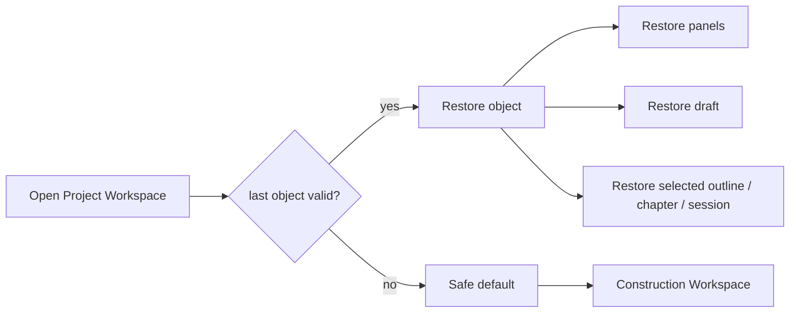
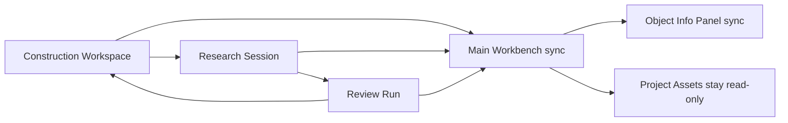
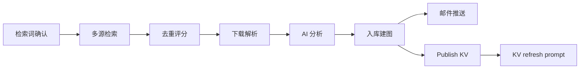
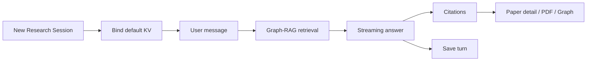

# UI / Workspace 设计

文档版本：v1.4
更新日期：2026-06-01
依据文档：`00_layers.md`、`01_functional_requirements.md`、当前工作树 `04_information_architecture_ui.md`

## 1. 设计目标

UI / Workspace 层负责用户可见的信息架构、入口、对象切换、状态展示和可操作 affordance。所有写操作最终必须通过 Application Use Cases 校验，前端禁用态只用于改善体验。

## 2. 全局页面结构

| 页面 | 主要内容 | 写操作入口 | 关联 FR |
| --- | --- | --- | --- |
| 登录/注册 | 账号登录、注册、公开错误页 | 注册、登录、登出 | FR-001 |
| Project Hub | Project 列表、创建入口、状态、最近活动、Knowledge Version 可用性 | 创建、编辑、归档、暂停、恢复、软删除、私人资产清理 | FR-008 |
| 用户设置 | 账户、LLM、数据源、通知 | 保存配置、测试连接、测试邮件 | FR-002 至 FR-004 |
| 管理员设置 | 用户管理、系统默认 LLM/数据源/SMTP、硬限制、调度开关 | 用户治理、系统配置保存、连接测试 | FR-005 至 FR-007, FR-009 |
| 观点广场 | 观点列表、搜索、筛选、发布页 | 发布、删除本人观点、管理员隐藏 | FR-010 |
| Project Workspace | Project 内 Construction/Research/Review 工作台与知识资产 | 通过具体对象工作台触发 | FR-011 至 FR-036 |

## 3. Project Workspace Shell

Workspace Shell 必须绑定当前 Project，并分为以下稳定区域：

| 区域 | 职责 |
| --- | --- |
| 顶层栏 | Project 名称、状态、版本提示、系统级入口返回、用户菜单 |
| Project 选择栏 | 当前用户有权限的 Project 列表，可展开/折叠 |
| 对象选择栏 | Construction Workspace、Research Session 列表、Review Run 列表 |
| 主体流程栏 | 当前选中对象的主工作区，不可折叠 |
| Project 信息面板 | 论文库、Graph、Knowledge Version、自动追踪摘要 |
| Run/Session 信息面板 | 当前对象状态、配置快照、阶段、错误、引用、导出 |

切换对象时，主体流程栏和 Run/Session 信息面板必须同步切换。面板展开/折叠、Project 跳转、观点广场跳转不得中断后台任务或流式回复。

## 4. Workspace 对象入口

### 4.1 Construction Workspace

展示长期检索词、检索词级数据源策略、自动更新开关、最近 Construction Run 摘要、历史 Construction Run 列表、配置快照、日志摘要、结果和手动启动入口。

写操作必须在 Construction Workspace 内触发，不在 Project 总列表中直接执行。

### 4.2 Research Session

展示对话历史、当前绑定 Knowledge Version、Graph-RAG 引用和跳转、输出倾向选择、总结与导出入口。同一 Session 存在流式回复时，输入区进入等待态，展示取消或查看状态入口。

### 4.3 Review Run

展示综述主题、范围、大纲、章节列表、章节状态、引用、审查记录、终稿、摘要、关键词、参考文献、导出和版本历史入口。章节写入中时，该章节的生成、重试、覆盖操作应锁定；其他章节是否可编辑由应用用例校验。

## 5. 知识资产面板

Project 信息面板提供只读知识资产：

- 论文统计、列表、筛选和详情。
- PDF 或远程资源访问入口，必须使用鉴权或签名 URL。
- Graph 图谱节点、关系和论文详情互跳。
- Project 默认 Knowledge Version 与当前对象绑定版本。
- 缺失、过期、无权限、版本不匹配时的安全空态。

不得提供上传、删除、重新下载、重新解析、重新评分、重新分析、入库、推送或图谱重建动作。

## 6. 禁用态与提示

| 场景 | 展示行为 |
| --- | --- |
| 无可用 Knowledge Version | Research/Review 新建入口禁用，提示先完成一次 Construction Run |
| Project archived | Workspace 进入只读模式，写操作禁用并展示归档原因 |
| Project deleted | 禁止进入 Workspace，返回 Project Hub 并展示软删除状态 |
| 权限不足 | 隐藏不可访问入口或展示无权限空态，后端仍必须拒绝 |
| 配置缺失/失效 | 任务启动按钮显示修复入口，指向用户设置或管理员设置 |
| active Construction Run 已存在 | 禁用同 Project 新 Construction Run，展示当前运行对象 |
| 内容覆盖风险 | 弹出覆盖确认，说明将覆盖的内容来源和最后编辑者 |
| Knowledge Version 过期 | 展示刷新提示，不自动改写当前内容 |

内容保护的权威判断由 Application Use Cases 和后台状态执行。UI 只展示用户完成当前决策所需的最小反馈，例如禁用原因、覆盖确认、冲突对象、影响范围和最后编辑者；不得依赖前端状态绕过后台保护，也不展示完整内部状态机。

## 7. 上下文恢复

P0 恢复最近打开 Project、最近打开对象、基础面板展开状态和输入草稿。P1 增强恢复滚动位置、日志和步骤落点、筛选条件、最近查看的论文或 Graph 节点。

恢复失败时应回到安全空态或 Project Hub，不得打开其他用户或其他 Project 的上下文。

## 8. UI 验收检查

- 每个 P0/P1 FR 都能找到用户入口或明确的后台入口。
- UI 所有写操作对应一个 Application Use Case。
- archived/deleted/无权限/配置缺失/锁冲突/版本过期均有可见反馈。
- 知识资产面板只读。
- 引用跳转能处理缺失、过期和越权。
- 响应式范围至少覆盖桌面浏览器和平板/窄屏可用布局。


## 9. 页面线框附录（由旧 UI Wireframes v1.5 适配）

适配说明：本附录从当前工作树 `04_information_architecture_ui.md` 迁入，用作新 `UI / Workspace` 设计的页面级实现参考。术语和约束按新工作树更新：`recommendations` 统一按 `viewpoints`/观点广场理解；`dialogues` 按 `research-sessions` 理解；知识资产入口保持只读，不提供上传、删除、重新解析、重新评分、入库、推送或图谱重建；阶段跳过不作为 Construction Run 的通用能力。

### P01 登录 / 注册

```text
┌──────────────────────────────────────────────────────────────┐
│ Research Paper Base                                          │
├──────────────────────────────────────────────────────────────┤
│                                                              │
│                 ┌──────────────────────────┐                 │
│                 │  [登录]      [注册]      │                 │
│                 ├──────────────────────────┤                 │
│                 │  用户名 / 邮箱            │                 │
│                 │  ┌────────────────────┐  │                 │
│                 │  │                    │  │                 │
│                 │  └────────────────────┘  │                 │
│                 │  密码              [👁]  │                 │
│                 │  ┌────────────────────┐  │                 │
│                 │  │                    │  │                 │
│                 │  └────────────────────┘  │                 │
│                 │  确认密码                │                 │
│                 │  ┌────────────────────┐  │                 │
│                 │  │                    │  │                 │
│                 │  └────────────────────┘  │                 │
│                 │  ┌────────────────────┐  │                 │
│                 │  │      提交           │  │                 │
│                 │  └────────────────────┘  │                 │
│                 │  错误 / 禁用状态         │                 │
│                 └──────────────────────────┘                 │
│                                                              │
└──────────────────────────────────────────────────────────────┘
```

### P02 Project Hub

```text
┌────────────────────────────────────────────────────────────────────────────┐
│ Logo  Projects  Plaza  Settings  Admin?       [Current Model ▼]  Avatar   │
├──────────────────┬─────────────────────────────────────────────────────────┤
│ 状态             │ My Projects                                             │
│ ● active         │ ┌────────────┬───────────────┬────────────┬──────────┐ │
│ ○ paused         │ │ 搜索        │ 状态 ▼         │ KV ▼        │ + Project│ │
│ ○ archived       │ └────────────┴───────────────┴────────────┴──────────┘ │
│                  │                                                         │
│ 自动追踪         │ ┌─────────────────────────────────────────────────────┐ │
│ ☑ 开启           │ │ Project A                           active   KV-12  │ │
│ ☐ 暂停           │ │ 论文 128 | 最近构建 2026-05-12 | 最近活动 10:22     │ │
│                  │ │ 自动追踪 on | active run CR-018                    │ │
│                  │ │ [进入] [编辑] [暂停] [归档] [删除]                 │ │
│                  │ └─────────────────────────────────────────────────────┘ │
│                  │ ┌─────────────────────────────────────────────────────┐ │
│                  │ │ Project B                           paused   无 KV  │ │
│                  │ │ 论文 0 | 最近构建 -- | 最近活动 2026-05-10          │ │
│                  │ │ 自动追踪 off                                       │ │
│                  │ │ [进入] [编辑] [恢复] [归档] [删除]                 │ │
│                  │ └─────────────────────────────────────────────────────┘ │
└──────────────────┴─────────────────────────────────────────────────────────┘
```

### P03 Project 新建 / 编辑

```text
┌──────────────────────────────────────────────────────────────┐
│ Project                                                [×]   │
├──────────────────────────────────────────────────────────────┤
│ 名称                                                         │
│ ┌──────────────────────────────────────────────────────────┐ │
│ └──────────────────────────────────────────────────────────┘ │
│ 研究主题 / 范围                                               │
│ ┌──────────────────────────────────────────────────────────┐ │
│ │                                                          │ │
│ │                                                          │ │
│ └──────────────────────────────────────────────────────────┘ │
│ 状态        [active ▼]                                       │
│ 自动追踪    [on/off]                                         │
│                                                              │
│ [取消]                                           [保存]       │
└──────────────────────────────────────────────────────────────┘
```

### P04 观点广场

```text
┌────────────────────────────────────────────────────────────────────────────┐
│ Logo  Projects  Plaza  Settings                              Avatar       │
├────────────────────────────────────────────────────────────────────────────┤
│ [发布观点]  类型 ▼  标签 ▼  排序 ▼  ┌──────────────────────────────┐     │
│                                      │ 搜索                         │     │
│                                      └──────────────────────────────┘     │
├────────────────────────────────────────────────────────────────────────────┤
│ ┌──────────────────────────────────────────────────────────────────────┐   │
│ │ 类型  标题                                               [删除?]     │   │
│ │ 作者 / 邮箱 / 时间 / 标签                                           │   │
│ │ 正文预览                                                             │   │
│ │ [查看全文] [复制联系信息]                                            │   │
│ └──────────────────────────────────────────────────────────────────────┘   │
│ ┌──────────────────────────────────────────────────────────────────────┐   │
│ │ 类型  标题                                                           │   │
│ │ 作者 / 用户名 / 时间 / 标签                                          │   │
│ │ 正文预览                                                             │   │
│ │ [查看全文] [复制联系信息]                                            │   │
│ └──────────────────────────────────────────────────────────────────────┘   │
└────────────────────────────────────────────────────────────────────────────┘
```

### P05 观点发布

```text
┌──────────────────────────────────────────────────────────────┐
│ 发布观点                                               [×]   │
├──────────────────────────────────────────────────────────────┤
│ 类型        [研究结论 ▼]                                     │
│ 标题                                                         │
│ ┌──────────────────────────────────────────────────────────┐ │
│ └──────────────────────────────────────────────────────────┘ │
│ 正文                                                         │
│ ┌──────────────────────────────────────────────────────────┐ │
│ │                                                          │ │
│ │                                                          │ │
│ │                                                          │ │
│ └──────────────────────────────────────────────────────────┘ │
│ 标签        ┌────────────────────────────────────────────┐   │
│             └────────────────────────────────────────────┘   │
│ 联系信息    ○ 用户名    ○ 邮箱                               │
│                                                              │
│ [取消]                                           [发布]       │
└──────────────────────────────────────────────────────────────┘
```

### P06 个人设置 / 账户

```text
┌────────────────────────────────────────────────────────────────────────────┐
│ Settings / Profile                                           Avatar       │
├──────────────────┬─────────────────────────────────────────────────────────┤
│ Profile          │ 账户信息                                                │
│ LLM              │ ┌─────────────────────────────────────────────────────┐ │
│ Sources          │ │ 用户名                                              │ │
│ Notifications    │ │ 邮箱                                                │ │
│                  │ │ 头像                                                │ │
│                  │ │ 账号状态                 enabled / disabled         │ │
│                  │ │ 最近模型                 source / model             │ │
│                  │ │ [保存]                                             │ │
│                  │ └─────────────────────────────────────────────────────┘ │
└──────────────────┴─────────────────────────────────────────────────────────┘
```

### P07 个人设置 / LLM

```text
┌────────────────────────────────────────────────────────────────────────────┐
│ Settings / LLM                                               Avatar       │
├──────────────────┬──────────────────────┬─────────────────────────────────┤
│ Profile          │ Provider             │ Provider Editor                 │
│ LLM              │ + 添加               │ Type        [OpenAI ▼]          │
│ Sources          │ ┌──────────────────┐ │ Base URL                        │
│ Notifications    │ │ OpenAI      ok   │ │ API Key               [👁]      │
│                  │ │ Anthropic   err  │ │ Temperature  Max tokens         │
│                  │ │ Gemini      off  │ │ Enabled     [on/off]            │
│                  │ │ Custom      ok   │ │ [测试连接] [刷新模型] [保存]    │
│                  │ └──────────────────┘ │ [删除]                          │
│                  │                      │                                 │
│                  │                      │ 可用模型                         │
│                  │                      │ ┌─────────────┬───────────────┐ │
│                  │                      │ │ source      │ model         │ │
│                  │                      │ └─────────────┴───────────────┘ │
│                  │                      │ 测试结果 / 失败原因              │
└──────────────────┴──────────────────────┴─────────────────────────────────┘
```

### P08 个人设置 / 数据源

```text
┌────────────────────────────────────────────────────────────────────────────┐
│ Settings / Sources                                           Avatar       │
├──────────────────┬──────────────────────┬─────────────────────────────────┤
│ Profile          │ Sources              │ Source Editor                   │
│ LLM              │ + 添加               │ Type        [arXiv ▼]           │
│ Sources          │ ┌──────────────────┐ │ Enabled     [on/off]            │
│ Notifications    │ │ arXiv       on   │ │ Base URL                        │
│                  │ │ OpenAlex    on   │ │ API Key               [👁]      │
│                  │ │ Semantic    off  │ │ Rate limit                      │
│                  │ │ ADS         err  │ │ [测试连接] [保存] [删除]        │
│                  │ └──────────────────┘ │                                 │
│                  │                      │ 最近状态 / 失败原因              │
└──────────────────┴──────────────────────┴─────────────────────────────────┘
```

### P09 个人设置 / 通知

```text
┌────────────────────────────────────────────────────────────────────────────┐
│ Settings / Notifications                                     Avatar       │
├──────────────────┬─────────────────────────────────────────────────────────┤
│ Profile          │ 收件邮箱                                                │
│ LLM              │ ┌─────────────────────────────────────────────────────┐ │
│ Sources          │ │ email@lab.edu  on  新论文 / 失败 / 完成             │ │
│ Notifications    │ │ another@lab.edu off 新论文                          │ │
│                  │ └─────────────────────────────────────────────────────┘ │
│                  │ [+ 邮箱] [发送测试邮件]                                │
│                  │                                                         │
│                  │ 通知偏好                                                │
│                  │ ☑ 新论文推送  ☑ 自动任务失败  ☐ 构建完成              │
│                  │ [保存]                                                  │
└──────────────────┴─────────────────────────────────────────────────────────┘
```

### P10 管理员 / 用户

```text
┌────────────────────────────────────────────────────────────────────────────┐
│ Admin / Users                                                Avatar       │
├────────────────────────────────────────────────────────────────────────────┤
│ 搜索用户                  状态 ▼        角色 ▼                            │
├────────────────────────────────────────────────────────────────────────────┤
│ ┌──────────┬───────────────┬──────────┬──────────┬──────────┬──────────┐ │
│ │ 用户名    │ 邮箱           │ 角色      │ 状态      │ 最近登录  │ 操作      │ │
│ ├──────────┼───────────────┼──────────┼──────────┼──────────┼──────────┤ │
│ │ alice    │ a@lab.edu     │ admin    │ enabled  │ 05-12    │ 禁用 查看 │ │
│ │ bob      │ b@lab.edu     │ user     │ disabled │ 05-10    │ 启用 提权 │ │
│ └──────────┴───────────────┴──────────┴──────────┴──────────┴──────────┘ │
└────────────────────────────────────────────────────────────────────────────┘
```

### P11 管理员 / 系统配置

```text
┌────────────────────────────────────────────────────────────────────────────┐
│ Admin / System                                               Avatar       │
├──────────────────┬──────────────────────┬─────────────────────────────────┤
│ LLM Defaults     │ 配置列表             │ Editor                          │
│ Source Defaults  │ + 添加               │ Provider / Source / SMTP / Rule │
│ SMTP             │ ┌──────────────────┐ │ Base URL / Host                 │
│ Security         │ │ OpenAI     ok    │ │ API Key / Password     [👁]     │
│ Scheduler        │ │ arXiv      ok    │ │ 白名单 / 硬限制 / 并发上限       │
│ Health           │ │ SMTP       err   │ │ 调度周期 / 时间窗口 / 开关        │
│                  │ └──────────────────┘ │ [测试连接] [保存] [删除]        │
└──────────────────┴──────────────────────┴─────────────────────────────────┘
```

### P12 健康检查

```text
┌────────────────────────────────────────────────────────────────────────────┐
│ Health Check                                                Avatar        │
├────────────────────────────────────────────────────────────────────────────┤
│ API              [ok]        PostgreSQL       [ok]                         │
│ Vector Store     [ok]        Graph Engine     [warn]                       │
│ SMTP             [err]       Scheduler        [ok]                         │
│                                                                            │
│ ┌──────────────────────────────────────────────────────────────────────┐   │
│ │ 时间 | 服务 | 状态 | 诊断                                             │   │
│ └──────────────────────────────────────────────────────────────────────┘   │
└────────────────────────────────────────────────────────────────────────────┘
```

### P13 Project Workspace Shell

```text
┌──────────────────────────────────────────────────────────────────────────────────────┐
│ Logo [Project ▼] Projects Plaza Settings Admin?     [Current Model ▼] Avatar        │
├──────────────┬──────────────────────┬────────────────────────────────┬──────────────┤
│ Project Rail │ Objects              │ Main Workbench                 │ Info Panels  │
│              │                      │                                │              │
│ Project A    │ ┌──────────────────┐ │ ┌────────────────────────────┐ │ [Project ▾] │
│ active       │ │ Construction     │ │ │ Context Header             │ │ Papers      │
│ [暂停追踪]   │ │ Workspace        │ │ │ object / state / KV / lock │ │ Graph       │
│              │ └──────────────────┘ │ └────────────────────────────┘ │ Versions     │
│              │                      │                                │ [刷新依赖]   │
│ Recent       │                      │                                │ Auto update │
│ Project B    │ Research Sessions    │ mode-specific content          │              │
│ Project C    │ + New                │                                │ [Object ▾]  │
│              │ ┌──────────────────┐ │                                │ Status      │
│ + Project    │ │ RS-023 active    │ │                                │ Logs        │
│              │ │ RS-020 archived  │ │                                │ Citations   │
│              │ └──────────────────┘ │                                │ Results     │
│              │                      │                                │              │
│              │ Review Runs          │                                │              │
│              │ + New                │                                │              │
│              │ ┌──────────────────┐ │                                │              │
│              │ │ RV-008 running   │ │                                │              │
│              │ │ RV-004 done      │ │                                │              │
│              │ └──────────────────┘ │                                │              │
└──────────────┴──────────────────────┴────────────────────────────────┴──────────────┘
```

### P14 Workspace 空态 / 禁用态

```text
┌────────────────────────────────────────────────────────────────────────────┐
│ Project A                                      active / paused / archived │
├────────────────────────────────────────────────────────────────────────────┤
│                                                                            │
│                         ┌──────────────────────┐                           │
│                         │ Construction        │                           │
│                         │ [打开构建工作台]     │                           │
│                         └──────────────────────┘                           │
│                                                                            │
│                         ┌──────────────────────┐                           │
│                         │ Research Session     │                           │
│                         │ [需要可用 KV]        │                           │
│                         └──────────────────────┘                           │
│                                                                            │
│                         ┌──────────────────────┐                           │
│                         │ Review Run           │                           │
│                         │ [需要可用 KV]        │                           │
│                         └──────────────────────┘                           │
│                                                                            │
└────────────────────────────────────────────────────────────────────────────┘
```

### P15 Construction Workspace

```text
┌────────────────────────────────────────────────────────────────────────────┐
│ Construction Workspace       KV default: KV-12 [版本] [启动手动 Run]     │
├────────────────────────────┬───────────────────────────────────────────────┤
│ 检索词                      │ 最近 Construction Runs                       │
│ [+ 生成] [+ 手动添加]       │ ┌─────────┬─────────┬──────────┬──────────┐ │
│ ┌────────────────────────┐ │ │ Run     │ 类型     │ 状态      │ 操作      │ │
│ │ 关键词 / 布尔 / 排除词  │ │ │ CR-018 │ auto    │ running  │ 查看      │ │
│ │ 理由 / 覆盖方向         │ │ │ CR-017 │ manual  │ done     │ 查看 复制 │ │
│ │ 自动更新 [on/off]       │ │ │ CR-016 │ auto    │ failed   │ 查看 重试 │ │
│ │ 数据源 [arXiv OA ADS]   │ │ └─────────┴─────────┴──────────┴──────────┘ │
│ │ [编辑] [删除] [确认]    │ │                                               │
│ └────────────────────────┘ │ 自动更新摘要                                   │
│ ┌────────────────────────┐ │ ┌───────────────────────────────────────────┐ │
│ │ 关键词 / 布尔 / 排除词  │ │ │ enabled terms: 6 | next run: 02:00       │ │
│ │ 自动更新 [off]          │ │ │ last auto: CR-018 | failed sources: ADS  │ │
│ └────────────────────────┘ │ └───────────────────────────────────────────┘ │
└────────────────────────────┴───────────────────────────────────────────────┘
```

### P43 检索词生成审核

```text
┌────────────────────────────────────────────────────────────────────────────┐
│ 检索词生成审核                                      [接受选中] [弃用选中]│
├────────────────────────────────────────────────────────────────────────────┤
│ 生成来源: Project 主题 / 最近论文 / 用户补充范围                          │
│ ┌────┬──────────────┬──────────────┬────────────┬────────────┬──────────┐ │
│ │ 选 │ 关键词        │ 布尔 / 排除词 │ 数据源策略  │ 理由        │ 状态      │ │
│ ├────┼──────────────┼──────────────┼────────────┼────────────┼──────────┤ │
│ │ ☑  │ term-01      │ A AND B -C   │ arXiv OA   │ 覆盖方向 1  │ 候选      │ │
│ │ ☐  │ term-02      │ D OR E -F    │ ADS        │ 覆盖方向 2  │ 已编辑    │ │
│ └────┴──────────────┴──────────────┴────────────┴────────────┴──────────┘ │
│ 当前项: [编辑关键词] [编辑数据源] 自动更新 [on/off] [接受] [弃用]           │
└────────────────────────────────────────────────────────────────────────────┘
```

生成审核只在 Construction Workspace 内出现。候选词被接受后进入长期检索词列表；被弃用的候选保留最小记录用于避免重复建议。批量接受、弃用和人工编辑均必须通过应用用例校验。

### P16 手动 Construction Run 启动

```text
┌──────────────────────────────────────────────────────────────┐
│ 启动 Construction Run                                  [×]   │
├──────────────────────────────────────────────────────────────┤
│ 检索词                                                       │
│ ☑ term-01   ☑ term-02   ☐ term-03   ☑ term-04               │
│                                                              │
│ 时间范围        ┌──────────────┐ 至 ┌──────────────┐         │
│ 返回上限        ┌──────────────┐                              │
│                                                              │
│ 配置快照                                                       │
│ ┌──────────────────────────────────────────────────────────┐ │
│ │ LLM source / model | sources | rate limits | SMTP        │ │
│ └──────────────────────────────────────────────────────────┘ │
│                                                              │
│ [取消]                                           [启动]       │
└──────────────────────────────────────────────────────────────┘
```

### P17 Construction Run

```text
┌────────────────────────────────────────────────────────────────────────────┐
│ CR-018  auto  running  KV output: pending  [暂停] [取消] [日志] [复制]    │
├────────────────────────────────────────────────────────────────────────────┤
│ ① 检索词  ② 多源检索  ③ 去重评分  ④ 下载解析  ⑤ AI 分析  ⑥ 入库建图  ⑦ 邮件 │
├──────────────────────┬─────────────────────────────────────────────────────┤
│ Step                 │ 当前步骤                                            │
│ ① done              │ ┌─────────────────────────────────────────────────┐ │
│ ② done              │ │ 去重评分                                         │ │
│ ③ waiting           │ │ 输入: candidates 183 | existing 42              │ │
│ ④ locked            │ │ 输出: valid 61 | invalid 80 | duplicate 42      │ │
│ ⑤ locked            │ │ 等待: 用户确认有效论文                           │ │
│ ⑥ locked            │ │ 错误: ADS timeout                                │ │
│ ⑦ locked            │ └─────────────────────────────────────────────────┘ │
│                      │                                                     │
│                      │ ┌──────────────┬────────┬──────┬────────┬────────┐ │
│                      │ │ 标题          │ 来源   │ 分数 │ 状态    │ 操作    │ │
│                      │ ├──────────────┼────────┼──────┼────────┼────────┤ │
│                      │ │ paper A      │ arXiv  │ 9.1  │ valid  │ 详情 调整│ │
│                      │ │ paper B      │ OA     │ 5.4  │ invalid│ 详情 调整│ │
│                      │ └──────────────┴────────┴──────┴────────┴────────┘ │
│                      │                                                     │
│                      │ [重新评分] [返回检索词] [确认并继续]                │
└──────────────────────┴─────────────────────────────────────────────────────┘
```

### P44 Construction Run / 多源检索结果

```text
┌────────────────────────────────────────────────────────────────────────────┐
│ CR-018  多源检索                                      [取消] [查看日志]   │
├────────────────────────────────────────────────────────────────────────────┤
│ 检索词 4 | 数据源 3 | 返回 183 | 失败 1 | 限流 1                         │
│ ┌──────────┬────────┬────────────────────┬──────┬────────┬────────────┐ │
│ │ 检索词    │ 数据源 │ 查询式              │ 返回 │ 状态    │ 诊断 / 操作 │ │
│ ├──────────┼────────┼────────────────────┼──────┼────────┼────────────┤ │
│ │ term-01  │ arXiv  │ A AND B -C          │ 92   │ done   │ 查看       │ │
│ │ term-01  │ ADS    │ A AND B -C          │ 0    │ limited│ 稍后重试   │ │
│ │ term-02  │ OA     │ D OR E -F           │ --   │ failed │ 超时 重试   │ │
│ └──────────┴────────┴────────────────────┴──────┴────────┴────────────┘ │
│ [重试失败项]                                            [确认并继续]       │
└────────────────────────────────────────────────────────────────────────────┘
```

本视图只展示检索执行结果和受控重试入口，不提供跳过阶段、手动改写返回结果或绕过数据源策略的操作。

### P18 Construction Run / 下载解析

```text
┌────────────────────────────────────────────────────────────────────────────┐
│ CR-018  下载解析                                             [暂停] [取消]│
├────────────────────────────────────────────────────────────────────────────┤
│ 成功 48    失败 7    摘要降级 6    待重试 3                              │
├────────────────────────────────────────────────────────────────────────────┤
│ ┌──────────────┬────────────┬────────────┬────────────┬────────────────┐ │
│ │ 标题          │ PDF        │ 解析        │ 降级文本     │ 操作            │ │
│ ├──────────────┼────────────┼────────────┼────────────┼────────────────┤ │
│ │ paper A      │ ok         │ ok         │ no         │ 打开            │ │
│ │ paper B      │ failed     │ --         │ abstract   │ 重试 上传 PDF   │ │
│ └──────────────┴────────────┴────────────┴────────────┴────────────────┘ │
│                                                                            │
│ [确认并继续]                                                               │
└────────────────────────────────────────────────────────────────────────────┘
```

### P19 Construction Run / AI 分析

```text
┌────────────────────────────────────────────────────────────────────────────┐
│ CR-018  AI 分析                                               [暂停] [取消]│
├──────────────────────┬─────────────────────────────────────────────────────┤
│ 论文列表              │ 分析编辑                                            │
│ paper A              │ 一句话总结                                          │
│ paper B              │ ┌─────────────────────────────────────────────────┐ │
│ paper C              │ └─────────────────────────────────────────────────┘ │
│                      │ 亮点                                                │
│                      │ ┌─────────────────────────────────────────────────┐ │
│                      │ └─────────────────────────────────────────────────┘ │
│                      │ 相关性要点                                          │
│                      │ ┌─────────────────────────────────────────────────┐ │
│                      │ └─────────────────────────────────────────────────┘ │
│                      │ 方法与创新                                          │
│                      │ ┌─────────────────────────────────────────────────┐ │
│                      │ └─────────────────────────────────────────────────┘ │
│                      │ [重新生成] [保存人工修改] [确认]                   │
└──────────────────────┴─────────────────────────────────────────────────────┘
```

### P20 Construction Run / 入库建图

```text
┌────────────────────────────────────────────────────────────────────────────┐
│ CR-018  入库建图                                             [暂停] [取消]│
├────────────────────────────────────────────────────────────────────────────┤
│ 即将入库 valid 61 | 跳过 existing 42 | 风险 3                             │
│ ┌──────────────────────────────────────────────────────────────────────┐   │
│ │ 论文入库     pending / running / done / failed                        │   │
│ │ 向量切分     pending / running / done / failed                        │   │
│ │ Graph 更新   pending / running / done / failed                        │   │
│ │ KV 发布      pending / running / done / failed                        │   │
│ └──────────────────────────────────────────────────────────────────────┘   │
│                                                                            │
│ [开始入库] [查看失败项] [打开论文库] [打开 Graph]                          │
└────────────────────────────────────────────────────────────────────────────┘
```

### P21 Construction Run / 邮件推送

```text
┌────────────────────────────────────────────────────────────────────────────┐
│ CR-018  邮件推送                                                        │
├────────────────────────────────────────────────────────────────────────────┤
│ 新增有效论文 24 | 未推送 24 | 收件人 2 | 空邮件保护 off                  │
│ ┌──────────────────────────────────────────────────────────────────────┐   │
│ │ Project 名称                                                         │   │
│ │ 有效论文统计                                                         │   │
│ │ 论文摘要列表 / 来源检索词 / 来源数据源                                │   │
│ └──────────────────────────────────────────────────────────────────────┘   │
│                                                                            │
│ [预览] [发送] [记录空邮件并结束]                                                       │
└────────────────────────────────────────────────────────────────────────────┘
```

### P22 论文补充 / 上传

```text
┌──────────────────────────────────────────────────────────────┐
│ 补充论文                                               [×]   │
├──────────────────────────────────────────────────────────────┤
│ ○ DOI    ○ arXiv ID    ○ URL    ○ PDF                        │
│ ┌──────────────────────────────────────────────────────────┐ │
│ └──────────────────────────────────────────────────────────┘ │
│                                                              │
│ 元数据                                                       │
│ ┌──────────────────────────────────────────────────────────┐ │
│ │ 标题 / 作者 / 年份 / 摘要 / DOI / 来源                   │ │
│ └──────────────────────────────────────────────────────────┘ │
│                                                              │
│ 去重状态 / 解析状态 / 待确认                                 │
│                                                              │
│ [取消]                              [加入当前 Construction Run]│
└──────────────────────────────────────────────────────────────┘
```

### P23 Research Session

```text
┌────────────────────────────────────────────────────────────────────────────┐
│ RS-023  active  Bound KV: KV-12 [刷新] [倾向: 创新 ▼] [总结] [导出] [归档]│
├──────────────────────┬──────────────────────────────────────┬──────────────┤
│ Sessions             │ Conversation                         │ Evidence     │
│ + New                │ ┌──────────────────────────────────┐ │ KV-12        │
│ RS-023 active        │ │ User                              │ │ Citations    │
│ RS-020 archived      │ │ 研究问题...                       │ │ [paper A]    │
│                      │ ├──────────────────────────────────┤ │ [paper B]    │
│ Search / Tags        │ │ Agent                             │ │ Passages     │
│                      │ │ 回复流式输出... [paper A] [node] │ │ Graph hits   │
│                      │ ├──────────────────────────────────┤ │ [打开论文]   │
│                      │ │ Agent generating █                │ │ [打开 Graph] │
│                      │ └──────────────────────────────────┘ │              │
│                      │ ┌────────────────────────────┬─────┐ │              │
│                      │ │ 输入草稿                    │ 发送│ │              │
│                      │ └────────────────────────────┴─────┘ │              │
└──────────────────────┴──────────────────────────────────────┴──────────────┘
```

### P45 Research Session / 流式等待与失败恢复

```text
┌────────────────────────────────────────────────────────────────────────────┐
│ RS-023  generating  Bound KV: KV-12                  [取消生成] [状态]    │
├──────────────────────┬──────────────────────────────────────┬──────────────┤
│ Sessions             │ Conversation                         │ Evidence     │
│ RS-023 active        │ Agent 正在生成...                    │ 引用加载中   │
│                      │ ┌──────────────────────────────────┐ │ paper A ok   │
│                      │ │ 回复流式输出...                  │ │ paper B 等待 │
│                      │ └──────────────────────────────────┘ │ Graph hits   │
│                      │ ┌────────────────────────────┬─────┐ │              │
│                      │ │ 输入草稿已保留              │ 禁用│ │              │
│                      │ └────────────────────────────┴─────┘ │              │
│                      │ 失败时: 错误摘要 / [重试] / [保留草稿] │ 引用失败提示 │
└──────────────────────┴──────────────────────────────────────┴──────────────┘
```

流式回复期间不得重复发送同一 Session 的新消息。取消、失败重试和草稿恢复必须通过 Research Session 的应用用例执行；UI 只展示当前等待、失败和引用加载状态。

### P24 Research 倾向设置

```text
┌──────────────────────────────┐
│ 输出倾向                     │
├──────────────────────────────┤
│ ● 创新                       │
│ ○ 实验                       │
│ ○ 总结                       │
│                              │
│ [取消]             [应用]    │
└──────────────────────────────┘
```

### P25 Research 总结 / 导出

```text
┌──────────────────────────────────────────────────────────────┐
│ Research Session 输出                                  [×]   │
├──────────────────────────────────────────────────────────────┤
│ ○ 对话全文    ○ 引用列表    ○ 总结文件                       │
│                                                              │
│ 总结预览                                                     │
│ ┌──────────────────────────────────────────────────────────┐ │
│ │ 关键结论 / 未决问题 / 下一步                             │ │
│ └──────────────────────────────────────────────────────────┘ │
│                                                              │
│ [生成总结] [导出] [关闭]                                     │
└──────────────────────────────────────────────────────────────┘
```

### P46 Review Run 新建向导

```text
┌──────────────────────────────────────────────────────────────┐
│ 新建 Review Run                                        [×]   │
├──────────────────────────────────────────────────────────────┤
│ 主题                                                         │
│ ┌──────────────────────────────────────────────────────────┐ │
│ └──────────────────────────────────────────────────────────┘ │
│ 范围 / 排除方向                                               │
│ ┌──────────────────────────────────────────────────────────┐ │
│ └──────────────────────────────────────────────────────────┘ │
│ 目标读者        [领域研究者 ▼]                               │
│ 篇幅 / 深度      [中等综述 ▼]                                 │
│ 时间范围        ┌──────────────┐ 至 ┌──────────────┐         │
│ 引用偏好        ☑ 高相关  ☑ 近年  ☐ 经典基础                  │
│ Bound KV        KV-12                                         │
│                                                              │
│ [取消]                                      [生成大纲]        │
└──────────────────────────────────────────────────────────────┘
```

新建向导只收集生成大纲所需的最小边界。提交后创建 Review Run、绑定当前可用 Knowledge Version，并进入 P26 大纲生成与确认。

### P26 Review Run / 大纲

```text
┌────────────────────────────────────────────────────────────────────────────┐
│ RV-008  outline  Bound KV: KV-12       [重新生成] [确认大纲] [版本]       │
├──────────────────────┬──────────────────────────────────────┬──────────────┤
│ Review Runs          │ Outline Editor                       │ Context      │
│ + New                │ 标题                                  │ KV-12        │
│ RV-008 running       │ ┌──────────────────────────────────┐ │ 章节支撑度   │
│ RV-004 done          │ └──────────────────────────────────┘ │ 1 █████      │
│                      │ 摘要提示                              │ 2 ███        │
│ Steps                │ ┌──────────────────────────────────┐ │ 3 ██ low     │
│ ① 大纲 waiting       │ └──────────────────────────────────┘ │ 建议补充方向 │
│ ② 章节 locked        │                                      │ Papers       │
│ ③ 汇总 locked        │ 章节                                  │ Graph        │
│ ④ 导出 locked        │ ┌────┬──────────┬──────┬──────────┐ │              │
│                      │ │ No │ 标题      │ 类型  │ 操作      │ │              │
│                      │ │ 1  │ 引言      │ 背景  │ ↑ ↓ 编辑  │ │              │
│                      │ │ 2  │ 方法      │ 主题  │ ↑ ↓ 编辑  │ │              │
│                      │ └────┴──────────┴──────┴──────────┘ │              │
└──────────────────────┴──────────────────────────────────────┴──────────────┘
```

### P27 Review Run / 章节

```text
┌────────────────────────────────────────────────────────────────────────────┐
│ RV-008  chapter 2  Bound KV: KV-12    [生成] [重审] [确认章节] [版本]     │
├──────────────────────┬──────────────────────────────────────┬──────────────┤
│ Chapters             │ Markdown Editor                      │ Citations    │
│ 1 引言 已确认        │ ┌──────────────────────────────────┐ │ paper A      │
│ 2 方法 编辑中        │ │ ## 章节正文                       │ │ passage 1    │
│ 3 实验 待生成        │ │ ... [paper A]                     │ │ paper B      │
│ 4 未来 写入中        │ │                                  │ │ Graph nodes  │
│                      │ └──────────────────────────────────┘ │ Coverage     │
│ 审查记录              │                                      │ ███████░░    │
│ issue 1 open         │ 审查问题                              │ [论文详情]   │
│ issue 2 accepted     │ ┌──────────────────────────────────┐ │ [PDF]        │
│                      │ │ 准确性 / 完整性 / 逻辑 / 引用规范 │ │ [Graph]      │
│                      │ └──────────────────────────────────┘ │              │
│                      │ [接受建议] [手动编辑] [重新生成]      │              │
└──────────────────────┴──────────────────────────────────────┴──────────────┘
```

### P28 Review Run / 终稿

```text
┌────────────────────────────────────────────────────────────────────────────┐
│ RV-008  final  Bound KV: KV-12     [生成摘要] [终审] [确认终稿] [导出]    │
├──────────────────────┬──────────────────────────────────────┬──────────────┤
│ Document             │ Full Draft                           │ Final Check  │
│ 摘要                 │ ┌──────────────────────────────────┐ │ KV-12        │
│ 关键词               │ │ 标题                              │ │ 引用覆盖     │
│ 章节                 │ │ 摘要                              │ │ ████████░   │
│ 参考文献             │ │ 正文                              │ │ 参考文献 ok  │
│                      │ │ 参考文献                          │ │ 终审问题 3   │
│ Versions             │ └──────────────────────────────────┘ │ 导出版本     │
│ outline v3           │                                      │ pending      │
│ chapter v7           │ [编辑] [重新生成参考文献] [确认]     │              │
└──────────────────────┴──────────────────────────────────────┴──────────────┘
```

### P29 Review 版本历史

```text
┌──────────────────────────────────────────────────────────────┐
│ 版本历史                                               [×]   │
├──────────────────────────────────────────────────────────────┤
│ 类型 ▼      对象 ▼                                           │
│ ┌──────────┬────────┬──────────────┬──────────┬──────────┐  │
│ │ 类型      │ 版本   │ 来源动作       │ 创建人    │ 操作      │  │
│ ├──────────┼────────┼──────────────┼──────────┼──────────┤  │
│ │ outline  │ v3     │ 手动调整       │ alice    │ 查看 差异 │  │
│ │ chapter  │ v7     │ 重新生成       │ alice    │ 查看 差异 │  │
│ │ final    │ v2     │ 终审确认       │ alice    │ 查看 差异 │  │
│ └──────────┴────────┴──────────────┴──────────┴──────────┘  │
│                                                              │
│ [只读快照] [差异] [回退]                                     │
└──────────────────────────────────────────────────────────────┘
```

### P30 知识资产 / 论文库

```text
┌────────────────────────────────────────────────────────────────────────────┐
│ Project Assets / Papers                      Project KV: KV-12  Object KV │
├────────────────────────────────────────────────────────────────────────────┤
│ 标题 / 摘要 / 作者 搜索     来源 ▼  评分 ▼  有效性 ▼  推送 ▼  引用 ▼     │
├────────────────────────────────────────────────────────────────────────────┤
│ ┌──────────────┬────────┬──────┬────────┬────────┬────────┬────────────┐ │
│ │ 标题          │ 来源   │ 评分 │ 有效    │ 推送    │ 引用    │ 操作        │ │
│ ├──────────────┼────────┼──────┼────────┼────────┼────────┼────────────┤ │
│ │ paper A      │ arXiv  │ 9.1  │ yes    │ sent   │ 12     │ 详情 PDF 图 │ │
│ │ paper B      │ OA     │ 7.2  │ yes    │ no     │ 4      │ 详情 PDF 图 │ │
│ └──────────────┴────────┴──────┴────────┴────────┴────────┴────────────┘ │
└────────────────────────────────────────────────────────────────────────────┘
```

### P31 论文详情抽屉

```text
┌──────────────────────────────────────────────────────────────┐
│ 论文详情                                               [×]   │
├──────────────────────────────────────────────────────────────┤
│ 标题                                                         │
│ 作者 / 来源 / 年份 / DOI / arXiv ID                          │
│ 评分 / 有效性 / 推送状态 / 引用状态                           │
│                                                              │
│ 摘要                                                         │
│ ┌──────────────────────────────────────────────────────────┐ │
│ └──────────────────────────────────────────────────────────┘ │
│ 一句话总结                                                   │
│ 亮点                                                         │
│ 相关性要点                                                   │
│ 方法与创新                                                   │
│                                                              │
│ [打开 PDF] [远程访问] [Graph 节点]                            │
└──────────────────────────────────────────────────────────────┘
```

### P32 知识资产 / Graph

```text
┌────────────────────────────────────────────────────────────────────────────┐
│ Project Assets / Graph                       Project KV: KV-12  Object KV │
├──────────────────────────────┬─────────────────────────────────────────────┤
│ 节点类型                      │ Graph Canvas                                │
│ ☑ Paper                       │ ┌─────────────────────────────────────────┐ │
│ ☑ Author                      │ │      ○───○                               │ │
│ ☑ Keyword                     │ │     ╱  ╲  ╲                              │ │
│ ☑ Concept                     │ │    ○────○──○                             │ │
│ ☑ Method                      │ │       ╲                                  │ │
│                              │ │        ○                                 │ │
│ 搜索 / 高亮                   │ └─────────────────────────────────────────┘ │
│                              │                                             │
│ [打开论文详情] [打开 PDF]     │ 节点详情 / 关系边 / 引用来源                 │
└──────────────────────────────┴─────────────────────────────────────────────┘
```

### P33 导出中心

```text
┌──────────────────────────────────────────────────────────────┐
│ 导出中心                                               [×]   │
├──────────────────────────────────────────────────────────────┤
│ 导出对象                                                     │
│ ○ Project 论文库   ○ PDF 集合   ○ Research 对话   ○ Review 终稿│
│                                                              │
│ 范围筛选                                                     │
│ ┌──────────────────────────────────────────────────────────┐ │
│ └──────────────────────────────────────────────────────────┘ │
│                                                              │
│ 预览                                                         │
│ 文件数 / 预计大小 / 权限过滤 / 缺失项 / 失败项                 │
│                                                              │
│ [取消]                                      [开始异步导出]    │
└──────────────────────────────────────────────────────────────┘
```

### P34 新建 / 继续 / 复制 / 重跑

```text
┌──────────────────────────────────────────────────────────────┐
│ 实例操作                                               [×]   │
├──────────────────────────────────────────────────────────────┤
│ 类型    ○ Construction Run   ○ Research Session   ○ Review Run│
│ 操作    ○ 新建  ○ 继续  ○ 复制  ○ 重跑  ○ 归档  ○ 删除        │
│                                                              │
│ ┌──────────────┬────────────┬────────────┬────────┬────────┐ │
│ │ 名称          │ 类型        │ Bound KV   │ 状态    │ 更新时间 │ │
│ ├──────────────┼────────────┼────────────┼────────┼────────┤ │
│ │ RS-023       │ Research   │ KV-12      │ active │ 10:22  │ │
│ │ RV-008       │ Review     │ KV-12      │ run    │ 09:40  │ │
│ └──────────────┴────────────┴────────────┴────────┴────────┘ │
│                                                              │
│ 影响范围                                                     │
│ ┌──────────────────────────────────────────────────────────┐ │
│ └──────────────────────────────────────────────────────────┘ │
│                                                              │
│ [取消]                                           [确认]       │
└──────────────────────────────────────────────────────────────┘
```

### P35 知识库版本刷新

```text
┌──────────────────────────────────────────────────────────────┐
│ Knowledge Version                                      [×]   │
├──────────────────────────────────────────────────────────────┤
│ Project 默认版本       KV-13                                │
│ 当前对象绑定版本       KV-12                                │
│ 打开来源               Project Versions / Bound KV / 系统提示 │
│                                                              │
│ 依赖旧版本对象                                               │
│ ┌──────────────┬────────────┬────────────┬────────────────┐ │
│ │ 对象          │ 类型        │ 状态        │ 刷新可用        │ │
│ ├──────────────┼────────────┼────────────┼────────────────┤ │
│ │ RS-023       │ Research   │ active     │ no             │ │
│ │ RV-008       │ Review     │ inactive   │ yes            │ │
│ └──────────────┴────────────┴────────────┴────────────────┘ │
│                                                              │
│ 已完成内容保持不变                                           │
│ Review 后续章节使用新版本                                    │
│                                                              │
│ [稍后]                [保持旧版本]        [刷新可用对象]       │
└──────────────────────────────────────────────────────────────┘
```

### P36 冲突 / 覆盖 / 锁定

```text
┌──────────────────────────────────────────────────────────────┐
│ 当前操作不可执行                                      [×]    │
├──────────────────────────────────────────────────────────────┤
│ ○ 已有 active Construction Run                               │
│ ○ 当前回复正在生成                                           │
│ ○ 当前章节正在写入                                           │
│ ○ 人工修改内容需要覆盖确认                                   │
│ ○ 当前无可用 Knowledge Version                               │
│ ○ archived Project 只读                                      │
│                                                              │
│ 影响对象                                                     │
│ ┌──────────────────────────────────────────────────────────┐ │
│ └──────────────────────────────────────────────────────────┘ │
│                                                              │
│ [关闭] [查看对象] [确认覆盖] [稍后处理]                       │
└──────────────────────────────────────────────────────────────┘
```

### P37 删除 / 归档确认

```text
┌──────────────────────────────────────────────────────────────┐
│ 确认操作                                               [×]   │
├──────────────────────────────────────────────────────────────┤
│ 操作: 删除 / 归档 / 清空 Project 论文关联                    │
│ 对象: Project / Research Session / Review Run / Paper Links  │
│                                                              │
│ 影响范围                                                     │
│ ┌──────────────────────────────────────────────────────────┐ │
│ │ 历史记录 / 导出产物 / 运行中任务 / 其他 Project            │ │
│ └──────────────────────────────────────────────────────────┘ │
│                                                              │
│ 输入名称确认                                                 │
│ ┌──────────────────────────────────────────────────────────┐ │
│ └──────────────────────────────────────────────────────────┘ │
│                                                              │
│ [取消]                                      [确认执行]       │
└──────────────────────────────────────────────────────────────┘
```

### P38 上下文恢复



### P39 Workspace 对象切换



### P40 Construction Run 流程



### P41 Research Session 流程



### P42 Review Run 流程

```mermaid
flowchart LR
  A["New Review Run"] --> B["Bind default KV"]
  B --> C["Outline"]
  C --> D["Confirm outline"]
  D --> E["Chapter writing"]
  E --> F["Chapter review"]
  F --> G["Confirm chapters"]
  G --> H["Final draft"]
  H --> I["Final review"]
  I --> J["Exportable version"]
  J --> K["Export center"]
```



## 10. 设计审查结果（2026-06-01）

本次审查目标：检查当前 UI / Workspace 设计是否完整支撑 `01-01-FR-reference.md` 的使用需求，并是否符合研究人员围绕 Project、论文库、Graph-RAG 对话和综述写作的常见交互习惯。

总体结论：当前设计的大方向合理，Project Workspace、Construction / Research / Review 三类对象、知识资产只读、Knowledge Version 刷新、锁冲突、上下文恢复等核心结构已经覆盖主流程。本版已将 P0 使用闭环补入 P43-P46；P1/P2 增强仍建议后续按小增量处理。

| 优先级 | 涉及 FR | 审查发现 | 补强建议 |
| --- | --- | --- | --- |
| P0 | FR-011 至 FR-036 | 全局页面结构原先仅将 Project Workspace 标注到 FR-011 至 FR-019，容易遗漏 Construction / Research / Review 模式需求追踪。 | Project Workspace 的关联 FR 应覆盖 FR-011 至 FR-036，并在后续实现任务中按通用 Workspace、Construction、Research、Review 分组验收。 |
| P0 | FR-020 | 检索词生成入口已有，但生成后候选词审核、生成理由、布尔逻辑、排除词、数据源策略、批量接受/弃用状态不够明确。 | 已补入 P43“检索词生成审核”。 |
| P0 | FR-021 | Construction Run 流程缺少“检索词 × 数据源”的检索执行结果视图，用户难以排查数据源失败、限流、返回数不足或策略未生效。 | 已补入 P44“Construction Run / 多源检索结果”。 |
| P0 | FR-017, FR-032 至 FR-035 | 内容修改保护需要可见反馈，但权威判断不应放在 UI。 | 已收敛为后台裁决、UI 只展示最小禁用态、覆盖确认、冲突对象、影响范围和最后编辑者。 |
| P0 | FR-028 | Research Session 文本要求流式回复时输入等待态，但线框仍显示普通输入和发送按钮，取消、失败重试、引用加载中状态不够清楚。 | 已补入 P45“Research Session / 流式等待与失败恢复”。 |
| P0 | FR-032 | Review Run 从大纲编辑开始，缺少新建前的主题、范围、目标读者、篇幅、时间范围和引用偏好输入。 | 已补入 P46“Review Run 新建向导”。 |
| P1 | FR-014, FR-015, FR-023, FR-036 | 暂停、恢复、重试、复制、重跑、删除、版本回退等受控增强动作在线框中已有露出，但未标明 MVP 是否启用。 | 为 P1/P2 动作增加“隐藏、禁用或受控增强”的阶段说明，避免第一阶段实现范围膨胀。 |
| P1 | FR-019, FR-030, FR-034 | 导出中心已有异步导出入口，但缺少导出任务状态、完成下载、失败重试、历史导出记录和权限过滤明细。 | 增补异步导出状态面板，展示导出中、完成、失败、过期、重新生成和下载入口。 |

### 10.1 交互习惯评估

- 研究人员的高频路径是“进入 Project -> 查看知识资产状态 -> 发起构建/研究/综述 -> 回看引用和 PDF”。当前 Shell 和知识资产面板能支撑该路径。
- 构建流程涉及多步等待和人工确认，用户需要更强的过程可解释性。当前线框已有步骤容器，但还需要把每一步失败原因、等待项和人工决策结果展示得更稳定。
- Research 对话应避免用户在流式回复中重复发送或丢失草稿。等待态、取消态和失败恢复需要成为明确 UI 状态。
- Review 写作属于长流程编辑，内容保护由后台裁决；UI 只需在覆盖、锁冲突或失败时给出最小必要提示，避免暴露完整内部状态机。
- 导出和 PDF 集合可能耗时较长，应符合异步任务交互习惯：启动后可离开、可查看进度、完成后可下载、失败后可重试。

### 10.2 后续 UI 补强清单

后续补强不要求一次性重写本文档，建议按小增量增加以下线框或状态说明：

1. P47 异步导出任务状态。

## 11. 更改记录

| 版本 | 日期 | 变更摘要 |
| --- | --- | --- |
| v1.4 | 2026-06-01 | 最小化补齐 P0 UI 缺口：新增 P43-P46；将内容保护收敛为后台裁决、UI 最小反馈；保留 P47 为后续 P1 增强。 |
| v1.3 | 2026-06-01 | 写入 UI 设计审查结果；修正 Project Workspace 关联 FR 范围为 FR-011 至 FR-036；记录 Construction、Research、Review 和导出体验的后续补强项。 |
| v1.2 | 2026-05-22 | 建立 UI / Workspace 分层设计，迁入并适配旧页面线框。 |
